# wsXMR Liquidity Router - Sequence Diagrams

This document provides chain-agnostic sequence diagrams for the wsXMR Liquidity Router and VaultManager system. The diagrams illustrate the core flows for liquidity provision, atomic swaps, and position management.

## Table of Contents

1. [Pool Initialization](#pool-initialization)
2. [LP Vault Setup](#lp-vault-setup)
3. [Liquidity Allocation Flow](#liquidity-allocation-flow)
4. [Mutual Approval System](#mutual-approval-system)
5. [Position Creation](#position-creation)
6. [Position Closure](#position-closure)
7. [Fee Collection](#fee-collection)
8. [Mint Flow (XMR → wsXMR)](#mint-flow-xmr--wsxmr)
9. [Burn Flow (wsXMR → XMR)](#burn-flow-wsxmr--xmr)
10. [Liquidation Flow](#liquidation-flow) (hard + soft/backstop)
11. [Buy-and-Burn Mechanism](#buy-and-burn-mechanism)
12. [Withdrawal Flows](#withdrawal-flows)

---

## Pool Initialization

Before any liquidity positions can be created, the V3 DEX pool must be initialized with an oracle-derived price.

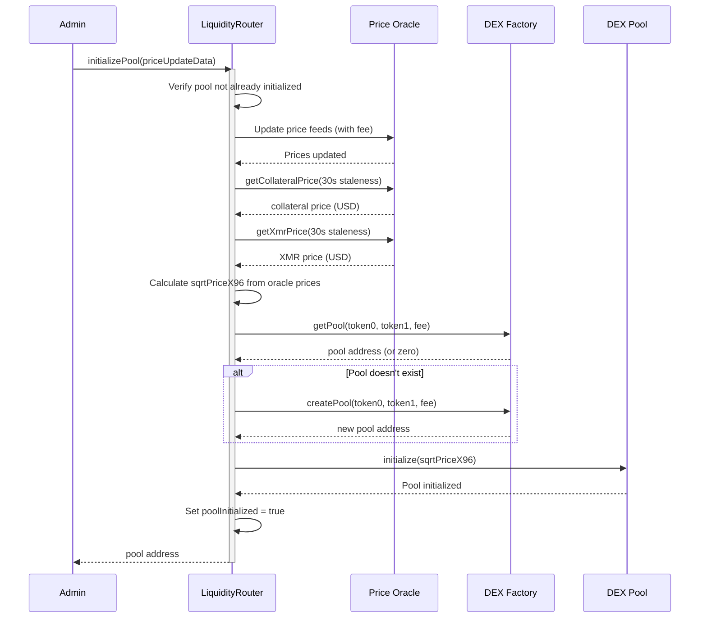
```mermaid
sequenceDiagram
    participant Admin
    participant Router as LiquidityRouter
    participant Oracle as Price Oracle
    participant Factory as DEX Factory
    participant Pool as DEX Pool

    Admin->>Router: initializePool(priceUpdateData)
    activate Router
    
    Router->>Router: Verify pool not already initialized
    Router->>Oracle: Update price feeds (with fee)
    Oracle-->>Router: Prices updated
    
    Router->>Oracle: getCollateralPrice(30s staleness)
    Oracle-->>Router: collateral price (USD)
    
    Router->>Oracle: getXmrPrice(30s staleness)
    Oracle-->>Router: XMR price (USD)
    
    Router->>Router: Calculate sqrtPriceX96 from oracle prices
    
    Router->>Factory: getPool(token0, token1, fee)
    Factory-->>Router: pool address (or zero)
    
    alt Pool doesn't exist
        Router->>Factory: createPool(token0, token1, fee)
        Factory-->>Router: new pool address
    end
    
    Router->>Pool: initialize(sqrtPriceX96)
    Pool-->>Router: Pool initialized
    
    Router->>Router: Set poolInitialized = true
    Router-->>Admin: pool address
    
    deactivate Router
```

---

## LP Vault Setup

LPs must create a vault and deposit collateral before participating in the system.

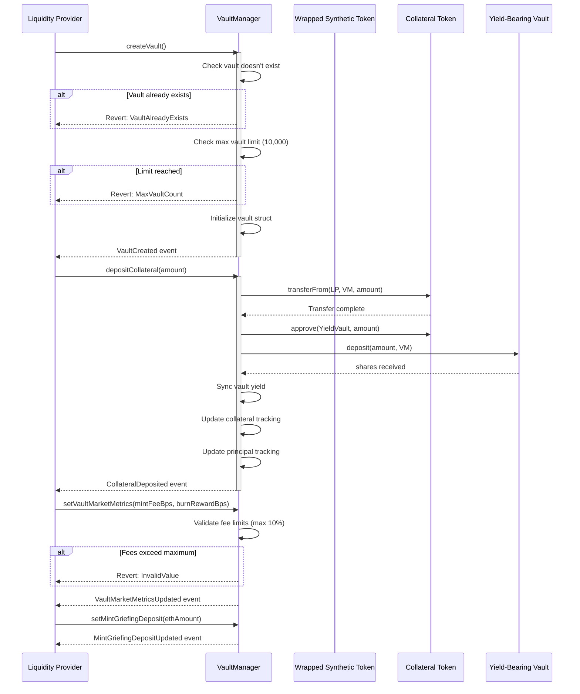
```mermaid
sequenceDiagram
    participant LP as Liquidity Provider
    participant VM as VaultManager
    participant Token as Wrapped Synthetic Token
    participant Collateral as Collateral Token
    participant YieldVault as Yield-Bearing Vault

    LP->>VM: createVault()
    activate VM
    VM->>VM: Check vault doesn't exist
    alt Vault already exists
        VM-->>LP: Revert: VaultAlreadyExists
    end
    VM->>VM: Check max vault limit (10,000)
    alt Limit reached
        VM-->>LP: Revert: MaxVaultCount
    end
    VM->>VM: Initialize vault struct
    VM-->>LP: VaultCreated event
    deactivate VM

    LP->>VM: depositCollateral(amount)
    activate VM
    VM->>Collateral: transferFrom(LP, VM, amount)
    Collateral-->>VM: Transfer complete
    
    VM->>Collateral: approve(YieldVault, amount)
    VM->>YieldVault: deposit(amount, VM)
    YieldVault-->>VM: shares received
    
    VM->>VM: Sync vault yield
    VM->>VM: Update collateral tracking
    VM->>VM: Update principal tracking
    VM-->>LP: CollateralDeposited event
    deactivate VM

    LP->>VM: setVaultMarketMetrics(mintFeeBps, burnRewardBps)
    VM->>VM: Validate fee limits (max 10%)
    alt Fees exceed maximum
        VM-->>LP: Revert: InvalidValue
    end
    VM-->>LP: VaultMarketMetricsUpdated event

    LP->>VM: setMintGriefingDeposit(ethAmount)
    VM-->>LP: MintGriefingDepositUpdated event
```

### Vault Deactivation & Collateral Withdrawal

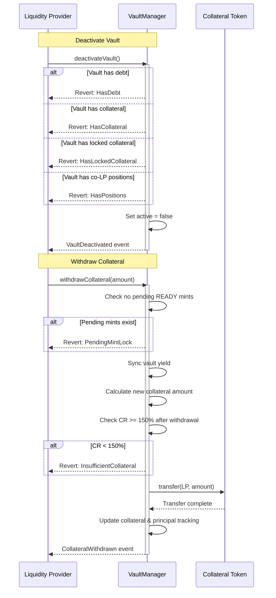
```mermaid
sequenceDiagram
    participant LP as Liquidity Provider
    participant VM as VaultManager
    participant Collateral as Collateral Token

    Note over LP,VM: Deactivate Vault
    LP->>VM: deactivateVault()
    activate VM
    alt Vault has debt
        VM-->>LP: Revert: HasDebt
    else Vault has collateral
        VM-->>LP: Revert: HasCollateral
    else Vault has locked collateral
        VM-->>LP: Revert: HasLockedCollateral
    else Vault has co-LP positions
        VM-->>LP: Revert: HasPositions
    end
    VM->>VM: Set active = false
    VM-->>LP: VaultDeactivated event
    deactivate VM

    Note over LP,VM: Withdraw Collateral
    LP->>VM: withdrawCollateral(amount)
    activate VM
    VM->>VM: Check no pending READY mints
    alt Pending mints exist
        VM-->>LP: Revert: PendingMintLock
    end
    VM->>VM: Sync vault yield
    VM->>VM: Calculate new collateral amount
    VM->>VM: Check CR >= 150% after withdrawal
    alt CR < 150%
        VM-->>LP: Revert: InsufficientCollateral
    end
    VM->>Collateral: transfer(LP, amount)
    Collateral-->>VM: Transfer complete
    VM->>VM: Update collateral & principal tracking
    VM-->>LP: CollateralWithdrawn event
    deactivate VM
```

---

## Liquidity Allocation Flow

LPs allocate collateral from their vault to the Liquidity Router for AMM positions.

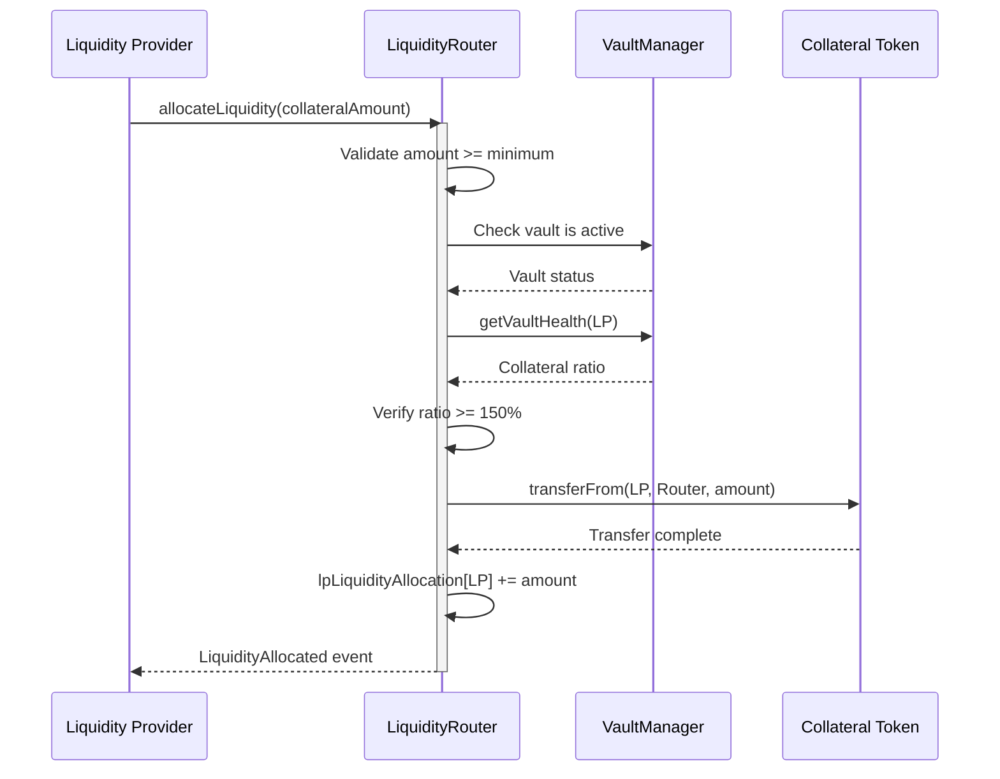
```mermaid
sequenceDiagram
    participant LP as Liquidity Provider
    participant Router as LiquidityRouter
    participant VM as VaultManager
    participant Collateral as Collateral Token

    LP->>Router: allocateLiquidity(collateralAmount)
    activate Router
    
    Router->>Router: Validate amount >= minimum
    Router->>VM: Check vault is active
    VM-->>Router: Vault status
    
    Router->>VM: getVaultHealth(LP)
    VM-->>Router: Collateral ratio
    Router->>Router: Verify ratio >= 150%
    
    Router->>Collateral: transferFrom(LP, Router, amount)
    Collateral-->>Router: Transfer complete
    
    Router->>Router: lpLiquidityAllocation[LP] += amount
    Router-->>LP: LiquidityAllocated event
    deactivate Router
```

---

## Mutual Approval System

Both LPs and Users must approve each other before positions can be created.

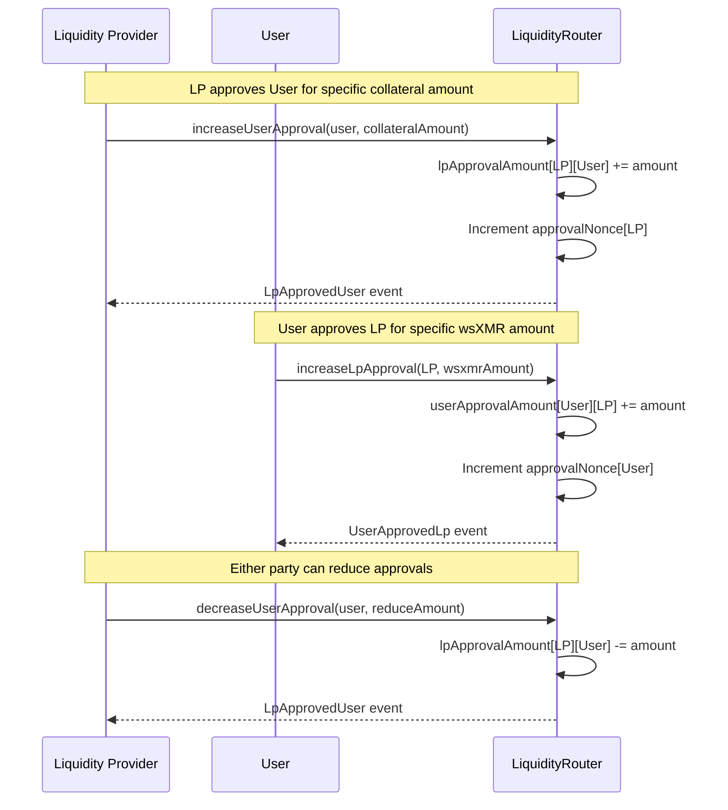
```mermaid
sequenceDiagram
    participant LP as Liquidity Provider
    participant User
    participant Router as LiquidityRouter

    Note over LP,Router: LP approves User for specific collateral amount
    LP->>Router: increaseUserApproval(user, collateralAmount)
    Router->>Router: lpApprovalAmount[LP][User] += amount
    Router->>Router: Increment approvalNonce[LP]
    Router-->>LP: LpApprovedUser event

    Note over User,Router: User approves LP for specific wsXMR amount
    User->>Router: increaseLpApproval(LP, wsxmrAmount)
    Router->>Router: userApprovalAmount[User][LP] += amount
    Router->>Router: Increment approvalNonce[User]
    Router-->>User: UserApprovedLp event

    Note over LP,Router: Either party can reduce approvals
    LP->>Router: decreaseUserApproval(user, reduceAmount)
    Router->>Router: lpApprovalAmount[LP][User] -= amount
    Router-->>LP: LpApprovedUser event
```

---

## Position Creation

Creating a matched liquidity position on the DEX.

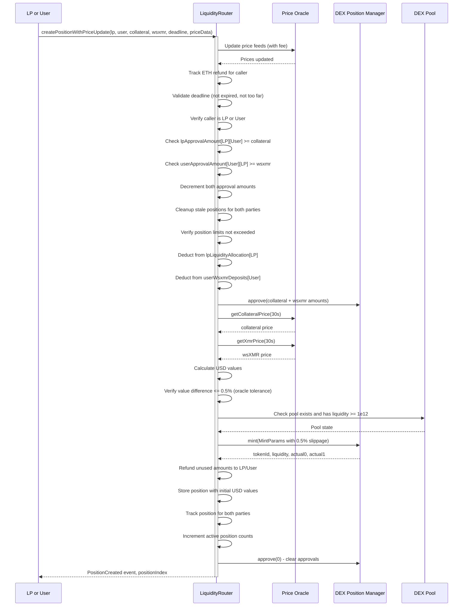
```mermaid
sequenceDiagram
    participant Caller as LP or User
    participant Router as LiquidityRouter
    participant Oracle as Price Oracle
    participant DEX as DEX Position Manager
    participant Pool as DEX Pool

    Caller->>Router: createPositionWithPriceUpdate(lp, user, collateral, wsxmr, deadline, priceData)
    activate Router
    
    Router->>Oracle: Update price feeds (with fee)
    Oracle-->>Router: Prices updated
    Router->>Router: Track ETH refund for caller
    
    Router->>Router: Validate deadline (not expired, not too far)
    Router->>Router: Verify caller is LP or User
    
    Router->>Router: Check lpApprovalAmount[LP][User] >= collateral
    Router->>Router: Check userApprovalAmount[User][LP] >= wsxmr
    Router->>Router: Decrement both approval amounts
    
    Router->>Router: Cleanup stale positions for both parties
    Router->>Router: Verify position limits not exceeded
    
    Router->>Router: Deduct from lpLiquidityAllocation[LP]
    Router->>Router: Deduct from userWsxmrDeposits[User]
    
    Router->>DEX: approve(collateral + wsxmr amounts)
    
    Router->>Oracle: getCollateralPrice(30s)
    Oracle-->>Router: collateral price
    Router->>Oracle: getXmrPrice(30s)
    Oracle-->>Router: wsXMR price
    
    Router->>Router: Calculate USD values
    Router->>Router: Verify value difference <= 0.5% (oracle tolerance)
    
    Router->>Pool: Check pool exists and has liquidity >= 1e12
    Pool-->>Router: Pool state
    
    Router->>DEX: mint(MintParams with 0.5% slippage)
    DEX-->>Router: tokenId, liquidity, actual0, actual1
    
    Router->>Router: Refund unused amounts to LP/User
    Router->>Router: Store position with initial USD values
    Router->>Router: Track position for both parties
    Router->>Router: Increment active position counts
    
    Router->>DEX: approve(0) - clear approvals
    Router-->>Caller: PositionCreated event, positionIndex
    deactivate Router
```

---

## Position Closure

Closing a position and distributing assets back to LP and User.

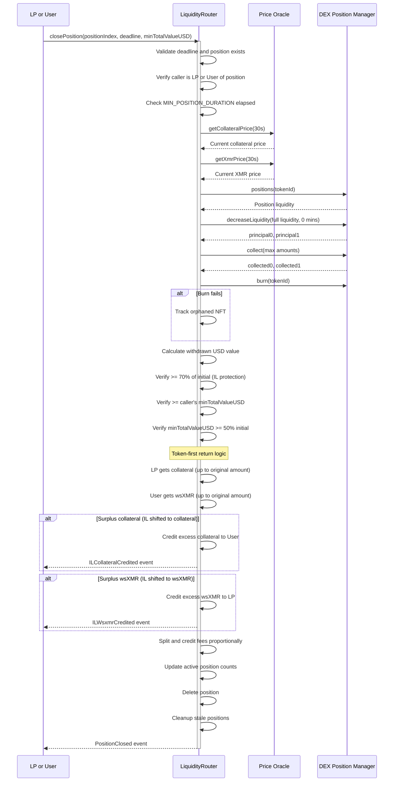
```mermaid
sequenceDiagram
    participant Caller as LP or User
    participant Router as LiquidityRouter
    participant Oracle as Price Oracle
    participant DEX as DEX Position Manager

    Caller->>Router: closePosition(positionIndex, deadline, minTotalValueUSD)
    activate Router
    
    Router->>Router: Validate deadline and position exists
    Router->>Router: Verify caller is LP or User of position
    Router->>Router: Check MIN_POSITION_DURATION elapsed
    
    Router->>Oracle: getCollateralPrice(30s)
    Oracle-->>Router: Current collateral price
    Router->>Oracle: getXmrPrice(30s)
    Oracle-->>Router: Current XMR price
    
    Router->>DEX: positions(tokenId)
    DEX-->>Router: Position liquidity
    
    Router->>DEX: decreaseLiquidity(full liquidity, 0 mins)
    DEX-->>Router: principal0, principal1
    
    Router->>DEX: collect(max amounts)
    DEX-->>Router: collected0, collected1
    
    Router->>DEX: burn(tokenId)
    alt Burn fails
        Router->>Router: Track orphaned NFT
    end
    
    Router->>Router: Calculate withdrawn USD value
    Router->>Router: Verify >= 70% of initial (IL protection)
    Router->>Router: Verify >= caller's minTotalValueUSD
    Router->>Router: Verify minTotalValueUSD >= 50% initial
    
    Note over Router: Token-first return logic
    Router->>Router: LP gets collateral (up to original amount)
    Router->>Router: User gets wsXMR (up to original amount)
    
    alt Surplus collateral (IL shifted to collateral)
        Router->>Router: Credit excess collateral to User
        Router-->>Caller: ILCollateralCredited event
    end
    
    alt Surplus wsXMR (IL shifted to wsXMR)
        Router->>Router: Credit excess wsXMR to LP
        Router-->>Caller: ILWsxmrCredited event
    end
    
    Router->>Router: Split and credit fees proportionally
    Router->>Router: Update active position counts
    Router->>Router: Delete position
    Router->>Router: Cleanup stale positions
    
    Router-->>Caller: PositionClosed event
    deactivate Router
```

---

## Fee Collection

Collecting trading fees from an active position without closing it.

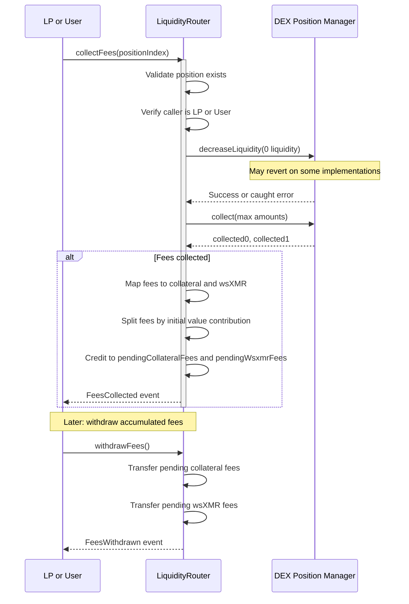
```mermaid
sequenceDiagram
    participant Caller as LP or User
    participant Router as LiquidityRouter
    participant DEX as DEX Position Manager

    Caller->>Router: collectFees(positionIndex)
    activate Router
    
    Router->>Router: Validate position exists
    Router->>Router: Verify caller is LP or User
    
    Router->>DEX: decreaseLiquidity(0 liquidity)
    Note over DEX: May revert on some implementations
    DEX-->>Router: Success or caught error
    
    Router->>DEX: collect(max amounts)
    DEX-->>Router: collected0, collected1
    
    alt Fees collected
        Router->>Router: Map fees to collateral and wsXMR
        Router->>Router: Split fees by initial value contribution
        Router->>Router: Credit to pendingCollateralFees and pendingWsxmrFees
        Router-->>Caller: FeesCollected event
    end
    
    deactivate Router

    Note over Caller,Router: Later: withdraw accumulated fees
    Caller->>Router: withdrawFees()
    Router->>Router: Transfer pending collateral fees
    Router->>Router: Transfer pending wsXMR fees
    Router-->>Caller: FeesWithdrawn event
```

---

## Mint Flow (XMR → wsXMR)

Complete atomic swap flow for minting wsXMR backed by XMR.

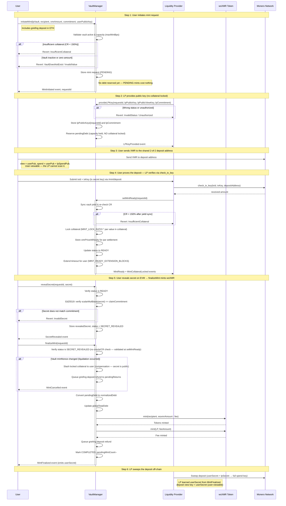
```mermaid
sequenceDiagram
    participant User
    participant VM as VaultManager
    participant LP as Liquidity Provider
    participant Token as wsXMR Token
    participant Monero as Monero Network

    Note over User,Monero: Step 1: User initiates mint request
    User->>VM: initiateMint(lpVault, recipient, xmrAmount, commitment, userPublicKey)
    activate VM
    Note right of User: Includes griefing deposit in ETH
    VM->>VM: Validate vault active & capacity (maxMintBps)
    alt Insufficient collateral (CR < 150%)
        VM-->>User: Revert: InsufficientCollateral
    else Vault inactive or zero amount
        VM-->>User: Revert: VaultDoesNotExist / InvalidValue
    end
    VM->>VM: Store mint request (PENDING)
    Note right of VM: No debt reserved yet — PENDING mints cost nothing
    VM-->>User: MintInitiated event, requestId
    deactivate VM

    Note over User,Monero: Step 2: LP provides public key (no collateral locked)
    LP->>VM: provideLPKey(requestId, lpPublicKey, lpPublicViewKey, lpCommitment)
    alt Wrong status or unauthorized
        VM-->>LP: Revert: InvalidStatus / Unauthorized
    end
    VM->>VM: Store lpPublicKeys[requestId] and lpCommitment
    VM->>VM: Reserve pendingDebt (capacity held, NO collateral locked)
    VM-->>LP: LPKeyProvided event

    Note over User,Monero: Step 3: User sends XMR to the shared 2-of-2 deposit address
    User->>Monero: Send XMR to deposit address
    Note right of User: view = userPub, spend = userPub + lpSpendPub.<br/>User-viewable — the LP cannot scan it.

    Note over User,Monero: Step 4: User proves the deposit — LP verifies via check_tx_key
    User->>LP: Submit txid + txKey (tx secret key) via /mint/deposit
    LP->>Monero: check_tx_key(txid, txKey, depositAddress)
    Monero-->>LP: received amount
    LP->>VM: setMintReady(requestId)
    activate VM
    VM->>VM: Sync vault yield & re-check CR
    alt CR < 150% after yield sync
        VM-->>LP: Revert: InsufficientCollateral
    end
    VM->>VM: Lock collateral (MINT_LOCK_RATIO * par value in collateral)
    VM->>VM: Store xmrPriceAtReady for par settlement
    VM->>VM: Update status to READY
    VM->>VM: Extend timeout for user (MINT_READY_EXTENSION_BLOCKS)
    VM-->>LP: MintReady + MintCollateralLocked events
    deactivate VM

    Note over User,Monero: Step 5: User reveals secret on EVM → finalizeMint mints wsXMR
    User->>VM: revealSecret(requestId, secret)
    activate VM
    VM->>VM: Verify status is READY
    VM->>VM: Ed25519: verify scalarMultBase(secret) == claimCommitment
    alt Secret does not match commitment
        VM-->>User: Revert: InvalidSecret
    end
    VM->>VM: Store revealedSecret, status = SECRET_REVEALED
    VM-->>User: SecretRevealed event
    deactivate VM

    User->>VM: finalizeMint(requestId)
    activate VM
    VM->>VM: Verify status is SECRET_REVEALED (no oracle/CR check — validated at setMintReady)
    alt Vault mintNonce changed (liquidation occurred)
        VM->>VM: Slash locked collateral to user (compensation — secret is public)
        VM->>VM: Queue griefing deposit refund to pendingReturns
        VM-->>User: MintCancelled event
    end
    VM->>VM: Convert pendingDebt to normalizedDebt
    VM->>VM: Update globalTotalDebt
    VM->>Token: mint(recipient, wsxmrAmount - fee)
    Token-->>VM: Tokens minted
    VM->>Token: mint(LP, feeAmount)
    Token-->>VM: Fee minted
    VM->>VM: Queue griefing deposit refund
    VM->>VM: Mark COMPLETED, pendingMintCount--
    VM-->>User: MintFinalized event (emits userSecret)
    deactivate VM

    Note over User,Monero: Step 6: LP sweeps the deposit off-chain
    LP->>Monero: Sweep deposit (userSecret + lpSecret → full spend key)
    Note right of LP: LP learned userSecret from MintFinalized.<br/>deposit view key = userSecret (user-viewable)
```

### Mint Cancellation Scenarios

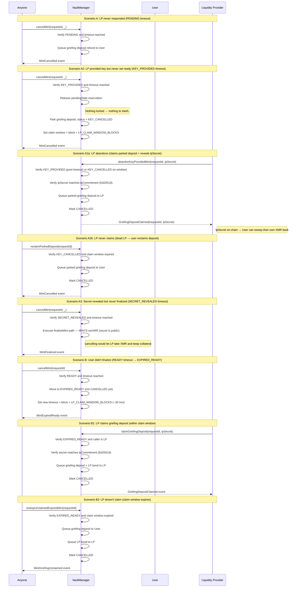
```mermaid
sequenceDiagram
    participant Anyone
    participant VM as VaultManager
    participant User
    participant LP as Liquidity Provider

    Note over Anyone,LP: Scenario A: LP never responded (PENDING timeout)
    Anyone->>VM: cancelMint(requestId, _)
    VM->>VM: Verify PENDING and timeout reached
    VM->>VM: Queue griefing deposit refund to User
    VM-->>Anyone: MintCancelled event

    Note over Anyone,LP: Scenario A2: LP provided key but never set ready (KEY_PROVIDED timeout)
    Anyone->>VM: cancelMint(requestId, _)
    VM->>VM: Verify KEY_PROVIDED and timeout reached
    VM->>VM: Release pendingDebt reservation
    Note right of VM: Nothing locked → nothing to slash.
    VM->>VM: Park griefing deposit, status = KEY_CANCELLED
    VM->>VM: Set claim window = block + LP_CLAIM_WINDOW_BLOCKS
    VM-->>Anyone: MintCancelled event

    Note over Anyone,LP: Scenario A2a: LP abandons (claims parked deposit + reveals lpSecret)
    LP->>VM: abandonKeyProvidedMint(requestId, lpSecret)
    VM->>VM: Verify KEY_PROVIDED (post-timeout) or KEY_CANCELLED (in window)
    VM->>VM: Verify lpSecret matches lpCommitment (Ed25519)
    VM->>VM: Queue parked griefing deposit to LP
    VM->>VM: Mark CANCELLED
    VM-->>LP: GriefingDepositClaimed(requestId, lpSecret)
    Note right of LP: lpSecret on-chain → User can sweep their own XMR back

    Note over Anyone,LP: Scenario A2b: LP never claims (dead LP — user reclaims deposit)
    Anyone->>VM: reclaimParkedDeposit(requestId)
    VM->>VM: Verify KEY_CANCELLED and claim window expired
    VM->>VM: Queue parked griefing deposit to User
    VM->>VM: Mark CANCELLED
    VM-->>Anyone: MintCancelled event

    Note over Anyone,LP: Scenario A3: Secret revealed but never finalized (SECRET_REVEALED timeout)
    Anyone->>VM: cancelMint(requestId, _)
    VM->>VM: Verify SECRET_REVEALED and timeout reached
    VM->>VM: Execute finalizeMint path — MINTS wsXMR (secret is public)
    Note right of VM: cancelling would let LP take XMR and keep collateral
    VM-->>Anyone: MintFinalized event

    Note over Anyone,LP: Scenario B: User didn't finalize (READY timeout → EXPIRED_READY)
    Anyone->>VM: cancelMint(requestId)
    VM->>VM: Verify READY and timeout reached
    VM->>VM: Move to EXPIRED_READY (not CANCELLED yet)
    VM->>VM: Set new timeout = block + LP_CLAIM_WINDOW_BLOCKS (~30 min)
    VM-->>Anyone: MintExpiredReady event

    Note over Anyone,LP: Scenario B1: LP claims griefing deposit (within claim window)
    LP->>VM: claimGriefingDeposit(requestId, lpSecret)
    VM->>VM: Verify EXPIRED_READY and caller is LP
    VM->>VM: Verify secret matches lpCommitment (Ed25519)
    VM->>VM: Queue griefing deposit + LP bond to LP
    VM->>VM: Mark CANCELLED
    VM-->>LP: GriefingDepositClaimed event

    Note over Anyone,LP: Scenario B2: LP doesn't claim (claim window expires)
    Anyone->>VM: sweepUnclaimedExpiredMint(requestId)
    VM->>VM: Verify EXPIRED_READY and claim window expired
    VM->>VM: Queue griefing deposit to User
    VM->>VM: Queue LP bond to LP
    VM->>VM: Mark CANCELLED
    VM-->>Anyone: MintGriefingUnclaimed event
```

---

## Burn Flow (wsXMR → XMR)

Complete atomic swap flow for burning wsXMR to receive XMR.

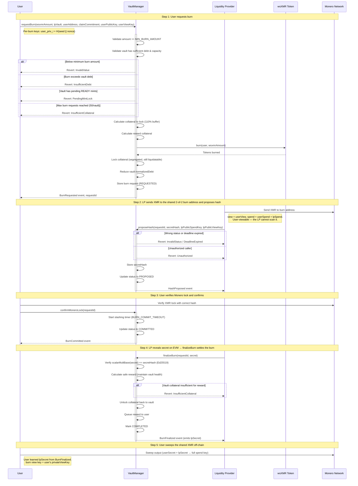
```mermaid
sequenceDiagram
    participant User
    participant VM as VaultManager
    participant LP as Liquidity Provider
    participant Token as wsXMR Token
    participant Monero as Monero Network

    Note over User,Monero: Step 1: User requests burn
    User->>VM: requestBurn(wsxmrAmount, lpVault, userAddress, claimCommitment, userPublicKey, userViewKey)
    Note right of User: Per-burn keys: user_priv_i = H(seed || nonce)
    activate VM
    VM->>VM: Validate amount >= MIN_BURN_AMOUNT
    VM->>VM: Validate vault has sufficient debt & capacity
    alt Below minimum burn amount
        VM-->>User: Revert: InvalidValue
    else Burn exceeds vault debt
        VM-->>User: Revert: InsufficientDebt
    else Vault has pending READY mints
        VM-->>User: Revert: PendingMintLock
    else Max burn requests reached (50/vault)
        VM-->>User: Revert: InsufficientCollateral
    end
    VM->>VM: Calculate collateral to lock (110% buffer)
    VM->>VM: Calculate reward collateral
    VM->>Token: burn(user, wsxmrAmount)
    Token-->>VM: Tokens burned
    VM->>VM: Lock collateral (segregated, still liquidatable)
    VM->>VM: Reduce vault normalizedDebt
    VM->>VM: Store burn request (REQUESTED)
    VM-->>User: BurnRequested event, requestId
    deactivate VM

    Note over User,Monero: Step 2: LP sends XMR to the shared 2-of-2 burn address and proposes hash
    LP->>Monero: Send XMR to burn address
    Note right of LP: view = userView, spend = userSpend + lpSpend.<br/>User-viewable — the LP cannot scan it.
    LP->>VM: proposeHash(requestId, secretHash, lpPublicSpendKey, lpPublicViewKey)
    activate VM
    alt Wrong status or deadline expired
        VM-->>LP: Revert: InvalidStatus / DeadlineExpired
    else Unauthorized caller
        VM-->>LP: Revert: Unauthorized
    end
    VM->>VM: Store secretHash
    VM->>VM: Update status to PROPOSED
    VM-->>LP: HashProposed event
    deactivate VM

    Note over User,Monero: Step 3: User verifies Monero lock and confirms
    User->>Monero: Verify XMR lock with correct hash
    User->>VM: confirmMoneroLock(requestId)
    activate VM
    VM->>VM: Start slashing timer (BURN_COMMIT_TIMEOUT)
    VM->>VM: Update status to COMMITTED
    VM-->>User: BurnCommitted event
    deactivate VM

    Note over User,Monero: Step 4: LP reveals secret on EVM → finalizeBurn settles the burn
    LP->>VM: finalizeBurn(requestId, secret)
    activate VM
    VM->>VM: Verify scalarMultBase(secret) == secretHash (Ed25519)
    VM->>VM: Calculate safe reward (maintain vault health)
    alt Vault collateral insufficient for reward
        VM-->>LP: Revert: InsufficientCollateral
    end
    VM->>VM: Unlock collateral back to vault
    VM->>VM: Queue reward to user
    VM->>VM: Mark COMPLETED
    VM-->>LP: BurnFinalized event (emits lpSecret)
    deactivate VM

    Note over User,Monero: Step 5: User sweeps the shared XMR off-chain
    User->>Monero: Sweep output (userSecret + lpSecret → full spend key)
    Note right of User: User learned lpSecret from BurnFinalized.<br/>burn view key = user's privateViewKey
```

### Burn Failure Scenarios

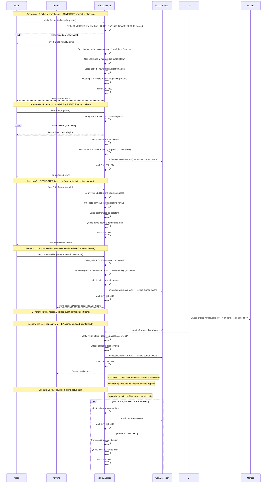
```mermaid
sequenceDiagram
    participant User
    participant Anyone
    participant VM as VaultManager
    participant Token as wsXMR Token

    Note over User,VM: Scenario A: LP failed to reveal secret (COMMITTED timeout → slashing)
    User->>VM: claimSlashedCollateral(requestId)
    VM->>VM: Verify COMMITTED and deadline + BURN_FINALIZE_GRACE_BLOCKS passed
    alt Grace period not yet expired
        VM-->>User: Revert: DeadlineNotExpired
    end
    VM->>VM: Calculate par value (wsxmrAmount * xmrPriceAtRequest)
    VM->>VM: Cap user base at min(par, lockedCollateral)
    VM->>VM: Seize locked + reward collateral from vault
    VM->>VM: Queue par + reward to user via pendingReturns
    VM->>VM: Mark SLASHED
    VM-->>User: BurnSlashed event

    Note over User,VM: Scenario B: LP never proposed (REQUESTED timeout → abort)
    User->>VM: abortBurn(requestId)
    VM->>VM: Verify REQUESTED and deadline passed
    alt Deadline not yet expired
        VM-->>User: Revert: DeadlineNotExpired
    end
    VM->>VM: Unlock collateral back to vault
    VM->>VM: Restore vault normalizedDebt (capped at current index)
    VM->>Token: mint(user, wsxmrAmount) — restore burned tokens
    VM->>VM: Mark CANCELLED
    VM-->>User: BurnAborted event

    Note over User,VM: Scenario B1: REQUESTED timeout → force settle (alternative to abort)
    User->>VM: forceSettleBurn(requestId)
    VM->>VM: Verify REQUESTED and deadline passed
    VM->>VM: Calculate par value in collateral (no reward)
    VM->>VM: Seize par from locked collateral
    VM->>VM: Queue par to user via pendingReturns
    VM->>VM: Mark SLASHED
    VM-->>User: BurnForceSettled event

    Note over User,VM: Scenario C: LP proposed but user never confirmed (PROPOSED timeout)
    User->>VM: resolveDeclinedProposal(requestId, userSecret)
    VM->>VM: Verify PROPOSED and deadline passed
    VM->>VM: Verify compressPoint(userSecret·G) = userPublicKey (Ed25519)
    VM->>VM: Unlock collateral back to vault
    VM->>Token: mint(user, wsxmrAmount) — restore burned tokens
    VM->>VM: Mark CANCELLED
    VM-->>Anyone: BurnProposalDeclined(requestId, userSecret)
    Note over User,VM: LP watches BurnProposalDeclined event, extracts userSecret
    LP->>Monero: Sweep shared XMR (userSecret + lpSecret → full spend key)

    Note over User,VM: Scenario C2: User gone entirely — LP abandons (dead-user fallback)
    LP->>VM: abandonProposedBurn(requestId)
    VM->>VM: Verify PROPOSED, deadline passed, caller is LP
    VM->>VM: Unlock collateral back to vault
    VM->>Token: mint(user, wsxmrAmount) — restore burned tokens
    VM->>VM: Mark CANCELLED
    VM-->>Anyone: BurnAborted event
    Note right of VM: LP's locked XMR is NOT recovered — needs userSecret
    Note right of VM: which is only revealed via resolveDeclinedProposal

    Note over User,VM: Scenario D: Vault liquidated during active burn
    Note right of VM: Liquidation handles in-flight burns automatically
    alt Burn is REQUESTED or PROPOSED
        VM->>VM: Unlock collateral, restore debt
        VM->>Token: mint(user, wsxmrAmount)
        VM->>VM: Mark CANCELLED
    else Burn is COMMITTED
        VM->>VM: Par-capped slash settlement
        VM->>VM: Queue par + reward to user
        VM->>VM: Mark SLASHED
    end
```

---

## Liquidation Flow

Two mechanisms exist for handling undercollateralized vaults: **hard liquidation** (collateral seized, debt written off) and **soft liquidation / backstop** (new LP absorbs the vault's position).

### Hard Liquidation

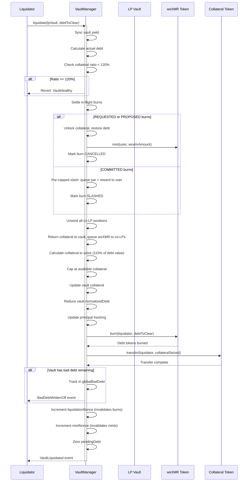
```mermaid
sequenceDiagram
    participant Liquidator
    participant VM as VaultManager
    participant Vault as LP Vault
    participant Token as wsXMR Token
    participant Collateral as Collateral Token

    Liquidator->>VM: liquidate(lpVault, debtToClear)
    activate VM
    
    VM->>VM: Sync vault yield
    VM->>VM: Calculate actual debt
    
    VM->>VM: Check collateral ratio < 120%
    alt Ratio >= 120%
        VM-->>Liquidator: Revert: VaultHealthy
    end
    
    VM->>VM: Settle in-flight burns
    alt REQUESTED or PROPOSED burns
        VM->>VM: Unlock collateral, restore debt
        VM->>Token: mint(user, wsxmrAmount)
        VM->>VM: Mark burn CANCELLED
    else COMMITTED burns
        VM->>VM: Par-capped slash: queue par + reward to user
        VM->>VM: Mark burn SLASHED
    end
    
    VM->>VM: Unwind all co-LP positions
    VM->>VM: Return collateral to vault, queue wsXMR to co-LPs
    
    VM->>VM: Calculate collateral to seize (110% of debt value)
    VM->>VM: Cap at available collateral
    
    VM->>VM: Update vault collateral
    VM->>VM: Reduce vault normalizedDebt
    VM->>VM: Update principal tracking
    
    VM->>Token: burn(liquidator, debtToClear)
    Token-->>VM: Debt tokens burned
    
    VM->>Collateral: transfer(liquidator, collateralSeized)
    Collateral-->>VM: Transfer complete
    
    alt Vault has bad debt remaining
        VM->>VM: Track in globalBadDebt
        VM-->>Liquidator: BadDebtWrittenOff event
    end
    
    VM->>VM: Increment liquidationNonce (invalidates burns)
    VM->>VM: Increment mintNonce (invalidates mints)
    VM->>VM: Zero pendingDebt
    
    VM-->>Liquidator: VaultLiquidated event
    deactivate VM
```

### Soft Liquidation — Vault Backstop

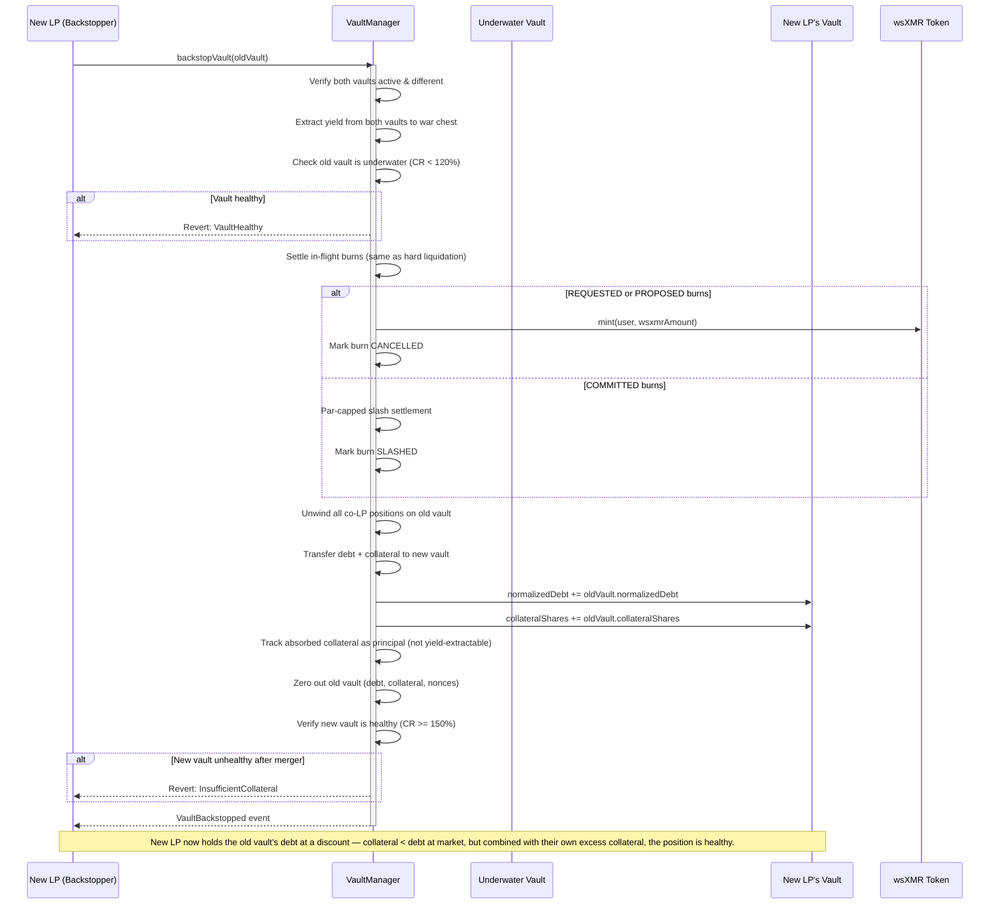
```mermaid
sequenceDiagram
    participant NewLP as New LP (Backstopper)
    participant VM as VaultManager
    participant OldVault as Underwater Vault
    participant NewVault as New LP's Vault
    participant Token as wsXMR Token

    NewLP->>VM: backstopVault(oldVault)
    activate VM
    
    VM->>VM: Verify both vaults active & different
    VM->>VM: Extract yield from both vaults to war chest
    
    VM->>VM: Check old vault is underwater (CR < 120%)
    alt Vault healthy
        VM-->>NewLP: Revert: VaultHealthy
    end
    
    VM->>VM: Settle in-flight burns (same as hard liquidation)
    alt REQUESTED or PROPOSED burns
        VM->>Token: mint(user, wsxmrAmount)
        VM->>VM: Mark burn CANCELLED
    else COMMITTED burns
        VM->>VM: Par-capped slash settlement
        VM->>VM: Mark burn SLASHED
    end
    
    VM->>VM: Unwind all co-LP positions on old vault
    
    VM->>VM: Transfer debt + collateral to new vault
    VM->>NewVault: normalizedDebt += oldVault.normalizedDebt
    VM->>NewVault: collateralShares += oldVault.collateralShares
    VM->>VM: Track absorbed collateral as principal (not yield-extractable)
    
    VM->>VM: Zero out old vault (debt, collateral, nonces)
    
    VM->>VM: Verify new vault is healthy (CR >= 150%)
    alt New vault unhealthy after merger
        VM-->>NewLP: Revert: InsufficientCollateral
    end
    
    VM-->>NewLP: VaultBackstopped event
    deactivate VM
    
    Note over NewLP,NewVault: New LP now holds the old vault's debt at a discount — collateral < debt at market, but combined with their own excess collateral, the position is healthy.
```

---

## Buy-and-Burn Mechanism

Automated yield-funded buy-and-burn to reduce system debt.

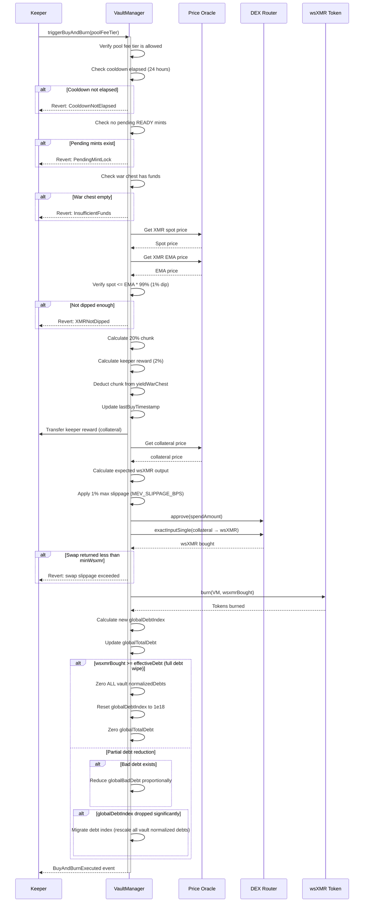
```mermaid
sequenceDiagram
    participant Keeper
    participant VM as VaultManager
    participant Oracle as Price Oracle
    participant DEX as DEX Router
    participant Token as wsXMR Token

    Keeper->>VM: triggerBuyAndBurn(poolFeeTier)
    activate VM
    
    VM->>VM: Verify pool fee tier is allowed
    VM->>VM: Check cooldown elapsed (24 hours)
    alt Cooldown not elapsed
        VM-->>Keeper: Revert: CooldownNotElapsed
    end
    
    VM->>VM: Check no pending READY mints
    alt Pending mints exist
        VM-->>Keeper: Revert: PendingMintLock
    end
    
    VM->>VM: Check war chest has funds
    alt War chest empty
        VM-->>Keeper: Revert: InsufficientFunds
    end
    
    VM->>Oracle: Get XMR spot price
    Oracle-->>VM: Spot price
    VM->>Oracle: Get XMR EMA price
    Oracle-->>VM: EMA price
    
    VM->>VM: Verify spot <= EMA * 99% (1% dip)
    alt Not dipped enough
        VM-->>Keeper: Revert: XMRNotDipped
    end
    
    VM->>VM: Calculate 20% chunk
    VM->>VM: Calculate keeper reward (2%)
    
    VM->>VM: Deduct chunk from yieldWarChest
    VM->>VM: Update lastBuyTimestamp
    
    VM->>Keeper: Transfer keeper reward (collateral)
    
    VM->>Oracle: Get collateral price
    Oracle-->>VM: collateral price
    VM->>VM: Calculate expected wsXMR output
    VM->>VM: Apply 1% max slippage (MEV_SLIPPAGE_BPS)
    
    VM->>DEX: approve(spendAmount)
    VM->>DEX: exactInputSingle(collateral → wsXMR)
    DEX-->>VM: wsXMR bought
    alt Swap returned less than minWsxmr
        VM-->>Keeper: Revert: swap slippage exceeded
    end
    
    VM->>Token: burn(VM, wsxmrBought)
    Token-->>VM: Tokens burned
    
    VM->>VM: Calculate new globalDebtIndex
    VM->>VM: Update globalTotalDebt
    
    alt wsxmrBought >= effectiveDebt (full debt wipe)
        VM->>VM: Zero ALL vault normalizedDebts
        VM->>VM: Reset globalDebtIndex to 1e18
        VM->>VM: Zero globalTotalDebt
    else Partial debt reduction
        alt Bad debt exists
            VM->>VM: Reduce globalBadDebt proportionally
        end
        alt globalDebtIndex dropped significantly
            VM->>VM: Migrate debt index (rescale all vault normalized debts)
        end
    end
    
    VM-->>Keeper: BuyAndBurnExecuted event
    deactivate VM
```

---

## Withdrawal Flows

### User wsXMR Withdrawal

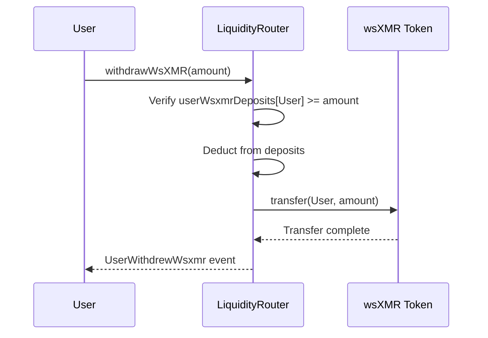
```mermaid
sequenceDiagram
    participant User
    participant Router as LiquidityRouter
    participant Token as wsXMR Token

    User->>Router: withdrawWsXMR(amount)
    Router->>Router: Verify userWsxmrDeposits[User] >= amount
    Router->>Router: Deduct from deposits
    Router->>Token: transfer(User, amount)
    Token-->>Router: Transfer complete
    Router-->>User: UserWithdrewWsxmr event
```

### LP collateral Withdrawal

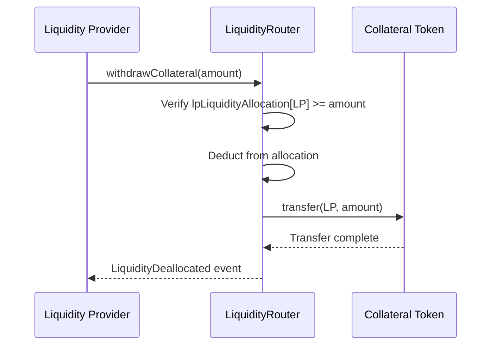
```mermaid
sequenceDiagram
    participant LP as Liquidity Provider
    participant Router as LiquidityRouter
    participant Collateral as Collateral Token

    LP->>Router: withdrawCollateral(amount)
    Router->>Router: Verify lpLiquidityAllocation[LP] >= amount
    Router->>Router: Deduct from allocation
    Router->>Collateral: transfer(LP, amount)
    Collateral-->>Router: Transfer complete
    Router-->>LP: LiquidityDeallocated event
```

### ETH Refund Withdrawal

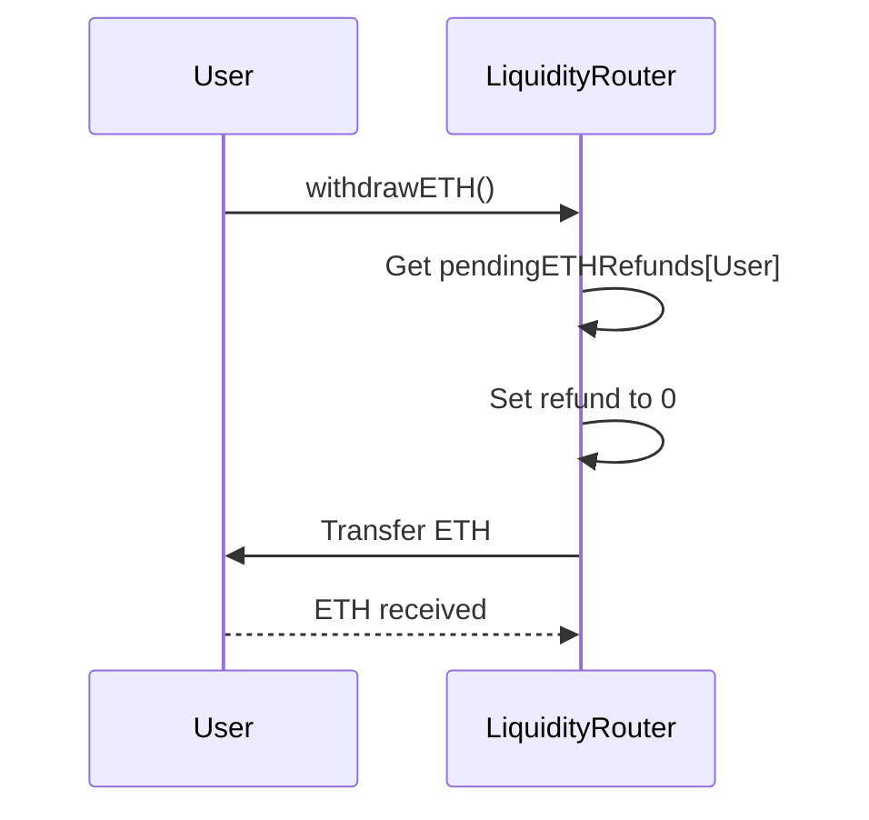
```mermaid
sequenceDiagram
    participant User
    participant Router as LiquidityRouter

    User->>Router: withdrawETH()
    Router->>Router: Get pendingETHRefunds[User]
    Router->>Router: Set refund to 0
    Router->>User: Transfer ETH
    User-->>Router: ETH received
```

### Pending Returns Withdrawal (VaultManager)

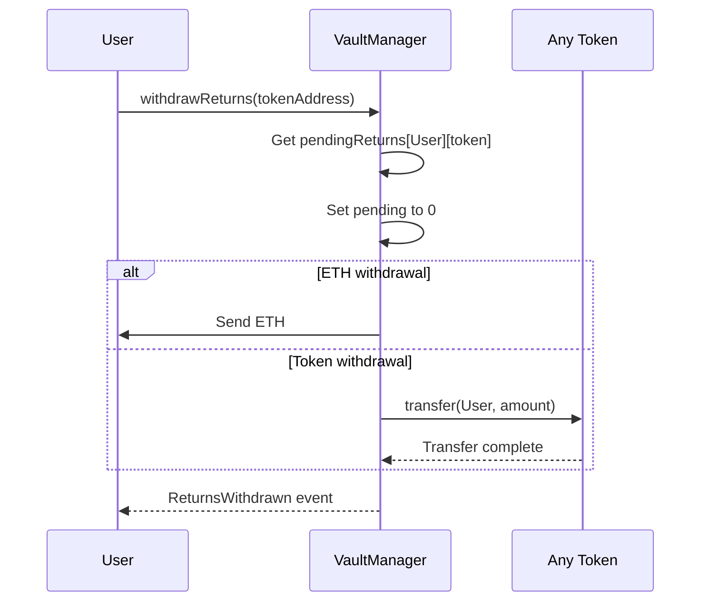
```mermaid
sequenceDiagram
    participant User
    participant VM as VaultManager
    participant Token as Any Token

    User->>VM: withdrawReturns(tokenAddress)
    VM->>VM: Get pendingReturns[User][token]
    VM->>VM: Set pending to 0
    alt ETH withdrawal
        VM->>User: Send ETH
    else Token withdrawal
        VM->>Token: transfer(User, amount)
        Token-->>VM: Transfer complete
    end
    VM-->>User: ReturnsWithdrawn event
```

---

# Core Protocol Sequence Diagrams

The diagrams below cover the mint, burn, liquidation, and yield flows for the wsXMR Hub + Facet diamond architecture on the EVM chain.

## Mint Flow (XMR → wsXMR)

### Happy Path

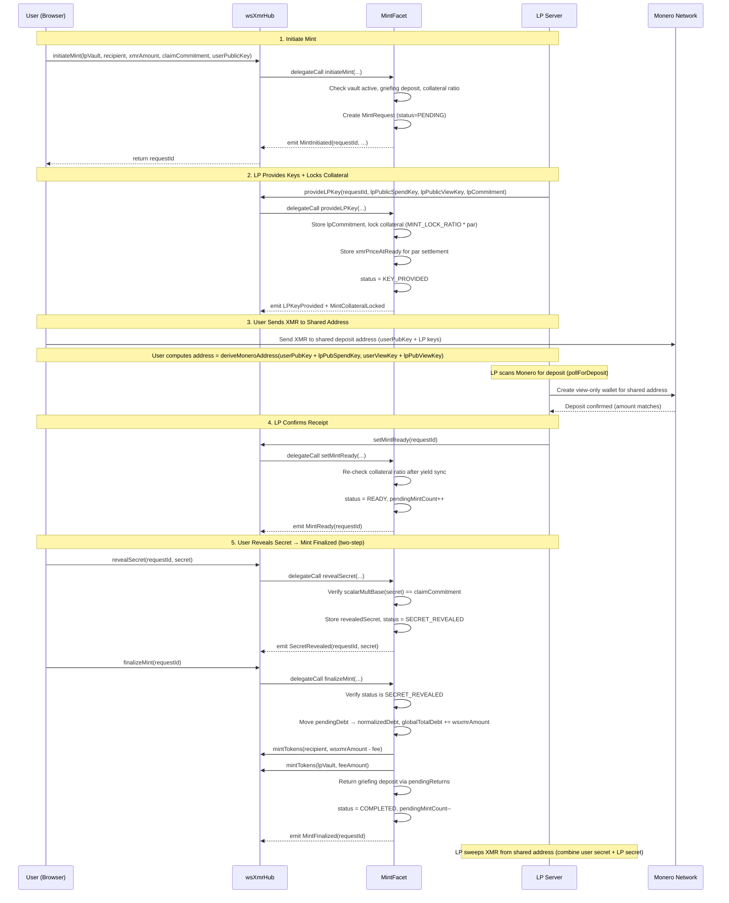
```mermaid
sequenceDiagram
    participant User as User (Browser)
    participant Hub as wsXmrHub
    participant Mint as MintFacet
    participant LP as LP Server
    participant XMR as Monero Network

    Note over User,LP: 1. Initiate Mint
    User->>Hub: initiateMint(lpVault, recipient, xmrAmount, claimCommitment, userPublicKey)
    Hub->>Mint: delegateCall initiateMint(...)
    Mint->>Mint: Check vault active, griefing deposit, collateral ratio
    Mint->>Mint: Create MintRequest (status=PENDING)
    Mint-->>Hub: emit MintInitiated(requestId, ...)
    Hub-->>User: return requestId

    Note over User,LP: 2. LP Provides Keys + Locks Collateral
    LP->>Hub: provideLPKey(requestId, lpPublicSpendKey, lpPublicViewKey, lpCommitment)
    Hub->>Mint: delegateCall provideLPKey(...)
    Mint->>Mint: Store lpCommitment, lock collateral (MINT_LOCK_RATIO * par)
    Mint->>Mint: Store xmrPriceAtReady for par settlement
    Mint->>Mint: status = KEY_PROVIDED
    Mint-->>Hub: emit LPKeyProvided + MintCollateralLocked

    Note over User,LP: 3. User Sends XMR to Shared Address
    User->>XMR: Send XMR to shared deposit address (userPubKey + LP keys)
    Note over User,LP: User computes address = deriveMoneroAddress(userPubKey + lpPubSpendKey, userViewKey + lpPubViewKey)

    Note over LP: LP scans Monero for deposit (pollForDeposit)
    LP->>XMR: Create view-only wallet for shared address
    XMR-->>LP: Deposit confirmed (amount matches)

    Note over User,LP: 4. LP Confirms Receipt
    LP->>Hub: setMintReady(requestId)
    Hub->>Mint: delegateCall setMintReady(...)
    Mint->>Mint: Re-check collateral ratio after yield sync
    Mint->>Mint: status = READY, pendingMintCount++
    Mint-->>Hub: emit MintReady(requestId)

    Note over User,LP: 5. User Reveals Secret → Mint Finalized (two-step)
    User->>Hub: revealSecret(requestId, secret)
    Hub->>Mint: delegateCall revealSecret(...)
    Mint->>Mint: Verify scalarMultBase(secret) == claimCommitment
    Mint->>Mint: Store revealedSecret, status = SECRET_REVEALED
    Mint-->>Hub: emit SecretRevealed(requestId, secret)

    User->>Hub: finalizeMint(requestId)
    Hub->>Mint: delegateCall finalizeMint(...)
    Mint->>Mint: Verify status is SECRET_REVEALED
    Mint->>Mint: Move pendingDebt → normalizedDebt, globalTotalDebt += wsxmrAmount
    Mint->>Hub: mintTokens(recipient, wsxmrAmount - fee)
    Mint->>Hub: mintTokens(lpVault, feeAmount)
    Mint->>Mint: Return griefing deposit via pendingReturns
    Mint->>Mint: status = COMPLETED, pendingMintCount--
    Mint-->>Hub: emit MintFinalized(requestId)

    Note over LP: LP sweeps XMR from shared address (combine user secret + LP secret)
```

### Mint Timeout / Cancel Paths

```mermaid
sequenceDiagram
    participant User
    participant Mint as MintFacet
    participant LP

    alt LP never provides keys (PENDING timeout)
        User->>Mint: cancelMint(requestId, userSecret) [after timeout]
        Mint->>Mint: status = CANCELLED
        Mint->>Mint: Return griefing deposit to user
        Mint-->>User: emit MintCancelled
    end

    alt LP provides keys but never sets ready (KEY_PROVIDED timeout)
        User->>Mint: cancelMint(requestId, userSecret) [after timeout]
        Mint->>Mint: Verify userSecret matches claimCommitment (Ed25519)
        Mint->>Mint: Slash locked collateral (par value) to user via pendingReturns
        Mint->>Mint: Return griefing deposit to user
        Mint->>Mint: Emit userSecret on-chain (LP can recover XMR)
        Mint-->>User: emit MintCancelledWithSecret(requestId, userSecret)
    end

    alt LP sets ready but user never finalizes (READY timeout)
        User->>Mint: cancelMint(requestId) [after timeout]
        Mint->>Mint: status = EXPIRED_READY
        Mint->>Mint: Extend timeout by LP_CLAIM_WINDOW_BLOCKS
        Mint-->>User: emit MintExpiredReady

        alt LP claims griefing deposit (proves liveness)
            LP->>Mint: claimGriefingDeposit(requestId, lpSecret)
            Mint->>Mint: Verify scalarMultBase(lpSecret) == lpCommitment
            Mint->>Mint: status = CANCELLED, griefing deposit → LP
            Mint-->>LP: emit GriefingDepositClaimed
        else LP never claims (LP_CLAIM_WINDOW expires)
            User->>Mint: sweepUnclaimedExpiredMint(requestId)
            Mint->>Mint: status = CANCELLED, griefing deposit → user
            Mint-->>User: emit MintGriefingUnclaimed
        end
    end
```

## Burn Flow (wsXMR → XMR)

### Happy Path

```mermaid
sequenceDiagram
    participant User as User (Browser)
    participant Hub as wsXmrHub
    participant Burn as BurnFacet
    participant LP as LP Server
    participant XMR as Monero Network

    Note over User,LP: 1. Request Burn
    User->>Hub: requestBurn(wsxmrAmount, lpVault, user, claimCommitment, userPublicKey, userViewKey)
    Hub->>Burn: delegateCall requestBurn(...)
    Burn->>Hub: burnTokens(user, wsxmrAmount)
    Burn->>Burn: Lock LP collateral (lockedCollateral += baseLock + rewardLock)
    Burn->>Burn: globalPendingBurnDebt += wsxmrAmount (debt NOT reduced yet)
    Burn->>Burn: Create BurnRequest (status=REQUESTED)
    Burn-->>Hub: emit BurnRequested(requestId, ...)

    Note over User,LP: 2. LP Proposes Hash (after locking XMR)
    LP->>XMR: Send XMR to user's Monero destination (shared address)
    LP->>Hub: proposeHash(requestId, secretHash, lpPublicSpendKey, lpPublicViewKey)
    Hub->>Burn: delegateCall proposeHash(...)
    Burn->>Burn: status = PROPOSED, set commit deadline
    Burn-->>Hub: emit HashProposed(requestId, ...)

    Note over User,LP: 3. User Confirms Monero Lock
    Note over User: Client MUST verify off-chain: XMR amount matches, secret binding correct
    User->>Hub: confirmMoneroLock(requestId)
    Hub->>Burn: delegateCall confirmMoneroLock(...)
    Burn->>Burn: status = COMMITTED, extend commit deadline
    Burn-->>Hub: emit BurnCommitted(requestId, deadline)

    Note over User,LP: 4. LP Finalizes Burn (reveals secret)
    LP->>Hub: finalizeBurn(requestId, secret)
    Hub->>Burn: delegateCall finalizeBurn(...)
    Burn->>Burn: Verify scalarMultBase(secret) == secretHash
    Burn->>Burn: Release locked collateral, pay reward via pendingReturns
    Burn->>Burn: Reduce vault.normalizedDebt, globalTotalDebt
    Burn->>Burn: status = COMPLETED
    Burn-->>Hub: emit BurnFinalized(requestId, secret, reward)

    Note over User: 5. User Sweeps XMR from Shared Address
    User->>XMR: Combine userSecret + lpSecret → full private spend key
    User->>XMR: Sweep all XMR from shared address to destination
    XMR-->>User: XMR received
```

### Burn Failure Paths

```mermaid
sequenceDiagram
    participant User
    participant Burn as BurnFacet
    participant LP

    alt LP never proposes (REQUESTED timeout)
        Note over User: Two options after deadline:

        User->>Burn: abortBurn(requestId)
        Burn->>Burn: Release locked collateral
        Burn->>Burn: mintTokens(user, wsxmrAmount) — restore wsXMR
        Burn->>Burn: status = CANCELLED
        Burn-->>User: emit BurnAborted

        User->>Burn: forceSettleBurn(requestId)
        Burn->>Burn: Pay par value in collateral (no reward) via pendingReturns
        Burn->>Burn: Release locked collateral, reduce debt
        Burn->>Burn: status = SLASHED
        Burn-->>User: emit BurnForceSettled
    end

    alt LP proposes but user never confirms (PROPOSED timeout)
        User->>Burn: resolveDeclinedProposal(requestId, userSecret) [needs userSecret]
        Burn->>Burn: Release locked collateral
        Burn->>Burn: mintTokens(user, wsxmrAmount) — restore wsXMR
        Burn->>Burn: status = CANCELLED
        Burn-->>User: emit BurnProposalDeclined(requestId, userSecret)
        Note over User,Burn: OR if user is gone: LP calls abandonProposedBurn(requestId)
        Note over User,Burn: same unwind but no userSecret → LP's XMR not recovered
    end

    alt User confirms but LP never finalizes (COMMITTED timeout + grace)
        User->>Burn: claimSlashedCollateral(requestId)
        Burn->>Burn: Pay min(par, lockedCollateral) + reward in collateral
        Burn->>Burn: Release locked collateral, reduce debt
        Burn->>Burn: status = SLASHED
        Burn-->>User: emit BurnSlashed
    end
```

## Liquidation Flow

```mermaid
sequenceDiagram
    participant Keeper as Keeper/Liquidator
    participant Hub as wsXmrHub
    participant Liq as LiquidationFacet
    participant Router as LiquidityRouter
    participant Vault as Underwater Vault

    Note over Keeper: Pre-check: isVaultLiquidatable(vault) == true (CR < LIQUIDATION_RATIO)

    Keeper->>Hub: liquidate(lpVault, debtToClear)
    Hub->>Liq: delegateCall liquidate(...)

    Note over Liq: Step 1: Harvest yield from vault
    Liq->>Liq: syncVaultYield — move excess collateral to yieldWarChest

    Note over Liq: Step 2: Handle in-flight burns
    loop For each burn in vault
        alt REQUESTED or PROPOSED
            Liq->>Liq: Force-cancel: release locked collateral
            Liq->>Hub: mintTokens(user, wsxmrAmount) — restore wsXMR
            Liq->>Liq: status = CANCELLED
        else COMMITTED
            Liq->>Liq: _settleCommittedBurnSlash: pay user par + reward in collateral
            Liq->>Liq: status = SLASHED
        end
    end

    Note over Liq: Step 3: Unwind all deployed V3 DEX positions
    loop For each position
        Liq->>Router: drainPosition(tokenId, slippage, xmrPrice)
        Router-->>Liq: daiOut, wsxmrOut
        Liq->>Liq: vault.collateralShares += daiOut
        Liq->>Liq: pendingReturns[user][wsxmr] += wsxmrOut
        Liq-->>Liq: emit CoLPUnwound
    end

    Note over Liq: Step 4: Seize collateral
    Liq->>Liq: Compute collateralToSeize = debtValue * LIQUIDATION_BONUS
    Liq->>Liq: Cap to available (collateralShares - lockedCollateral)
    Liq->>Liq: vault.collateralShares -= seized, vault.normalizedDebt -= cleared
    Liq->>Liq: globalTotalDebt -= debtToClear

    Note over Liq: Step 5: Write off bad debt if vault fully drained
    alt vault.normalizedDebt > 0 && collateralShares == 0
        Liq->>Liq: globalBadDebt += remaining, globalTotalDebt -= remaining
        Liq-->>Liq: emit BadDebtWrittenOff
    end

    Note over Liq: Step 6: Transfer assets
    Liq->>Liq: vault.liquidationNonce++, vault.mintNonce++
    Liq->>Hub: burnTokens(keeper, debtToClear)
    Liq->>Keeper: safeTransfer(collateral, collateralToSeize)
    Liq-->>Keeper: emit VaultLiquidated
```

## Vault Backstop Flow

```mermaid
sequenceDiagram
    participant NewLP as New LP (Backstopper)
    participant Hub as wsXmrHub
    participant Liq as LiquidationFacet
    participant OldVault as Underwater Vault
    participant NewVault as New LP's Vault

    NewLP->>Hub: backstopVault(oldVault)
    Hub->>Liq: delegateCall backstopVault(...)

    Note over Liq: Step 1: Harvest yield from both vaults
    Liq->>Liq: syncVaultYield(oldVault), syncVaultYield(newVault)

    Note over Liq: Step 2: Verify old vault is underwater
    Liq->>Liq: _calculateCRWithPositions(oldVault) < LIQUIDATION_RATIO

    Note over Liq: Step 3: Handle in-flight burns (same as liquidate)
    Liq->>Liq: Force-cancel REQUESTED/PROPOSED, settle COMMITTED

    Note over Liq: Step 4: Unwind old vault positions
    Liq->>Liq: _unwindAllVaultPositions(oldVault)

    Note over Liq: Step 5: Transfer debt + collateral to new vault
    Liq->>Liq: newVault.normalizedDebt += oldVault.normalizedDebt
    Liq->>Liq: newVault.collateralShares += oldVault.collateralShares
    Liq->>Liq: Track absorbed collateral as principal (prevent yield siphon)

    Note over Liq: Step 6: Zero out old vault
    Liq->>Liq: oldVault.normalizedDebt = 0, collateralShares = 0, lockedCollateral = 0
    Liq->>Liq: oldVault.liquidationNonce++, mintNonce++

    Note over Liq: Step 7: Verify new vault is healthy
    Liq->>Liq: _calculateCRWithPositions(newVault) >= COLLATERAL_RATIO
    Liq-->>NewLP: emit VaultBackstopped(oldVault, newLP, debt, collateral)
```

## Yield / Buy-and-Burn Flow

```mermaid
sequenceDiagram
    participant Keeper
    participant Hub as wsXmrHub
    participant Yield as YieldFacet
    participant Oracle as OracleFacet
    participant Collateral as collateral Contract
    participant Uni as V3 DEX Router

    Note over Keeper: Pre-check: canTriggerBuyAndBurn() == true
    Note over Keeper: Conditions: cooldown elapsed, war chest > 0, spot < EMA threshold, no pending mints

    Keeper->>Hub: triggerBuyAndBurn(poolFeeTier)
    Hub->>Yield: delegateCall triggerBuyAndBurn(...)

    Note over Yield: Step 1: Check conditions
    Yield->>Oracle: getXmrEmaPrice()
    Oracle-->>Yield: emaPrice
    Yield->>Yield: Verify spotPrice < emaPrice * EMA_TRIGGER_THRESHOLD

    Note over Yield: Step 2: Carve out chunk + keeper reward
    Yield->>Yield: collateralToSpend = warChest * BUY_CHUNK_PERCENT
    Yield->>Yield: keeperReward = collateralToSpend * 2%
    Yield->>Yield: yieldWarChest -= collateralToSpend

    Note over Yield: Step 3: Redeem collateral → DAI
    Yield->>Collateral: redeem(collateralForSwap, address(this), address(this))
    Collateral-->>Yield: daiAmount

    Note over Yield: Step 4: Swap DAI → wsXMR on V3 DEX
    Yield->>Yield: Approve DEX router for DAI
    Yield->>Uni: exactInputSingle(DAI → wsXMR, amountIn, minOut)
    Uni-->>Yield: wsxmrBought

    Note over Yield: Step 5: Pay keeper reward
    Yield->>Yield: pendingReturns[keeper][collateral] += keeperReward

    Note over Yield: Step 6: Burn purchased wsXMR
    Yield->>Hub: burnTokens(address(this), wsxmrBought)

    Note over Yield: Step 7: Forgive debt
    alt wsXMR bought >= effective debt (full wipe)
        Yield->>Yield: Zero all vault normalizedDebts
        Yield->>Yield: globalTotalDebt = globalPendingBurnDebt
        Yield->>Yield: globalDebtIndex = 1e18
    else Partial wipe
        Yield->>Yield: globalTotalDebt -= wsxmrBought
        Yield->>Yield: Scale globalDebtIndex down proportionally
    end

    Note over Yield: Step 8: Migrate debt index if too low
    Yield->>Yield: _migrateDebtIndex (rescale if index < 1e18)

    Yield-->>Keeper: emit BuyAndBurnExecuted(collateralSpent, wsXMRBurned, keeperReward, newIndex)
```

## Yield Harvest Flow

```mermaid
sequenceDiagram
    participant Caller as Anyone
    participant Hub as wsXmrHub
    participant Yield as YieldFacet
    participant YL as YieldLogic

    Caller->>Hub: syncVaultYield(lpVault)
    Hub->>Yield: delegateCall syncVaultYield(...)

    Yield->>YL: calculateExtractableYield(collateralShares, lockedCollateral, principal, debt, ...)
    YL-->>Yield: yieldShares (excess above principal + required collateral)

    alt yieldShares > 0
        Yield->>Yield: vault.collateralShares -= yieldShares
        Yield->>Yield: yieldWarChest += yieldShares
        Yield-->>Caller: emit YieldHarvested(lpVault, yieldShares)
    end
```
