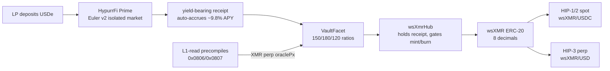
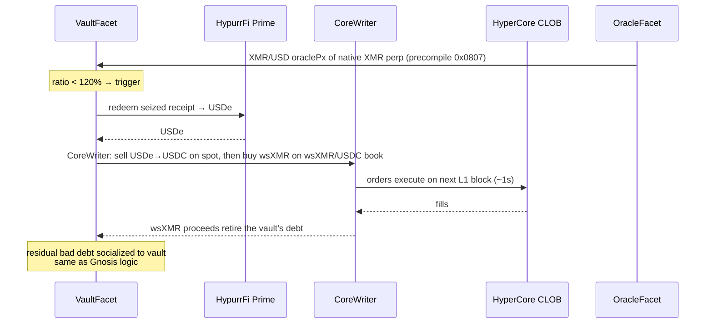

Here is a complete migration document. It's written in a voice and structure that matches the existing repo (`README.md`, `docs/sequenceDiagrams.md`, `docs/SEED_STORAGE_IMPLEMENTATION.md`) — assumes Foundry + Hardhat + Solidity + the `lp-server-js` LP server, deploys to HyperEVM mainnet (ChainID 999), and uses USDe supplied to HypurrFi Prime as the single collateral asset.

---

```markdown
# 🚀 WrapSynth HyperEVM Migration Spec

**Status:** Draft · September 2026
**Target chain:** HyperEVM (Hyperliquid L1), ChainID `999`, RPC `https://rpc.hyperliquid.xyz/evm`
**Canonical deployment:** replaces the Gnosis Chain beta as the primary venue once live

This document specifies the port of WrapSynth from Gnosis Chain (sDAI collateral, push oracle, Uniswap V3 co-LP) to HyperEVM (USDe collateral via HypurrFi Prime, native XMR perp oracle via L1-read precompiles, HIP-1 spot + partner-deployed HIP-3 perp listing). The architecture, security model, and Ed25519 atomic-swap settlement logic are preserved unchanged; only the collateral, oracle, and liquidity-routing layers are swapped.

---

## 1. Why migrate

### 1.1 What we keep
- **Hub + facet (Diamond, EIP-2535) architecture.** `wsXmrHub` continues to own all state and collateral; facets remain stateless and dispatch via the selector table. EIP-1153 transient-storage delegate-context flags are unchanged.
- **Ed25519 on-chain verification.** Mint/burn settlement still binds to Monero-side key material via `scalarMultBase(secret)` checked against the user's claim commitment.
- **Mint → trade → burn lifecycle.** `initiateMint` → `setMintReady` → `revealSecret` → `finalizeMint`; `requestBurn` → `confirmMoneroLock` → `finalizeBurn` / `abortBurn` / `forceSettleBurn`.
- **Griefing-deposit + timeout-based slashing.** Identical economic protection on both sides of the swap.
- **`lockHub()` / `lockDeployer()` one-way admin lock.** Deployer key is permanently powerless once setup completes, same as the live Gnosis v6.1 deployment.
- **LP server (`lp-server-js/`).** Event monitor, Monero RPC, quote pricing, REST API. Chain-agnostic; only RPC URL and contract addresses change.

### 1.2 What we replace
| Component | Gnosis (current) | HyperEVM (target) |
|---|---|---|
| Collateral | sDAI (Savings DAI, MakerDAO DSR) | USDe supplied to HypurrFi Prime (Euler v2 isolated market) |
| YieldFacet yield source | DSR harvested from MakerDAO pot | HypurrFi Prime USDe supply APY (~9.8%, accrued in receipt token) |
| Oracle | `SimpleOracleFacet` — push oracle, off-chain updater posts RedStone-derived prices | `HyperCoreOracleFacet` reads the **existing native XMR perp's** `oraclePx` via L1-read precompile `0x0807` — validator-maintained, no pusher at all (§4) |
| Trading venue | Uniswap V3 wsXMR/sDAI spot pool | HIP-1/HIP-2 wsXMR/USDC spot on HyperCore CLOB + HIP-3 wsXMR/USD perp market |
| Co-LP liquidity router | `wsXMRLiquidityRouter` (UniV3 concentrated liquidity) | `HyperCoreLiquidityRouter` posts laddered orders on wsXMR/USDC spot via CoreWriter; partner HIP-3 perp provides leverage venue |
| Liquidation path | seize sDAI → sell on UniV3 wsXMR/sDAI | seize USDe receipt → redeem to USDe → swap USDe→USDC on HyperCore spot → buy back wsXMR on the wsXMR/USDC spot book via CoreWriter (next-L1-block execution) |
| Settlement finality | ~5s blocks (Gnosis) | sub-second (HyperBFT) |
| Collateral ratios | 150% min / 180% target / 120% liq | Unchanged: 150% min / 180% target / 120% liq |

### 1.3 What this unlocks
1. **XMR/USD perp exposure via HIP-3 — through a partner deployer.** An existing HIP-3 deployer (already staked, already running oracle infrastructure) can list a wsXMR/USD perp on their DEX — no 500k HYPE stake and no 24/7 `setOracle` duty for WrapSynth. wsXMR graduates from a wrapped spot token to a leverage-bearing derivative. Self-deploying remains an option later (500k HYPE stake + deployer-operated oracle).
2. **Native oracle with genuinely no off-chain pusher.** A native validator-run XMR perp already exists on HyperCore (XMR-USDC, live since Jan 2026). Its `oraclePx` — maintained by the validator set from external CEX feeds — is readable from HyperEVM via the `0x0807` precompile in every block, for free. This retires the "oracle liveness depends on the off-chain price pusher" risk outright; WrapSynth operates no price infrastructure.
3. **No bridge between trading venue and smart contracts.** HyperCore and HyperEVM share HyperBFT consensus and global state. wsXMR (ERC-20 on HyperEVM) and wsXMR spot on HyperCore are the same asset, linked 1:1 — no wrapper-of-a-wrapper, no third-party bridge. Transfers between layers happen via the token's system address (`0x20` + token index, big-endian — see §5.1).
4. **CLOB liquidations instead of AMM dumps.** `LiquidationFacet` uses CoreWriter to redeem seized collateral and buy back wsXMR on the HyperCore spot book. CoreWriter actions execute on a subsequent L1 block (~1s) — not same-block atomic — but there is no AMM slippage and a much smaller MEV surface than a UniV3 swap.
5. **Finance-native user base.** Hyperliquid's traders are the target audience for a synthetic-XMR product. The HIP-3 wave (gold, silver, TSLA, NVDA perps) demonstrates active demand for non-ETH/BTC asset classes on the platform.

---

## 2. Architecture

### 2.1 High-level

```
                      ┌────────────────────────────────┐
                      │           wsXmrHub             │
                      │  state · collateral · token     │
                      │  selector → facet dispatch      │
                      │  EIP-1153 delegate context      │
                      └──────────┬─────────────────────┘
        ┌──────────┬─────────┬───┴────┬───────────┬──────────┐
   VaultFacet  MintFacet  BurnFacet  Liquidation  YieldFacet  OracleFacet
   (USDe+HypurrFi)  (same) (same)    Facet       (HypurrFi)  (HyperCore
                                                       precompile)
        │                                            │
        ▼                                            ▼
   ┌─────────────┐                          ┌──────────────────┐
   │ HypurrFi    │                          │ L1-read          │
   │ Prime       │ ←─ USDe yield            │ precompiles      │
   │ (Euler v2)  │                          │ 0x0806/07/08     │
   └─────────────┘                          │ XMR/USD (native  │
                                            │  XMR perp)       │
                                             └──────────────────┘
                                                          ▲
                                                          │ reads
   ┌──────────────────────────────────────────────────────┘
   │
   ▼
   ┌──────────────────────────────────────────────────┐
   │ HyperCore CLOB                                   │
   │  · HIP-1/HIP-2 wsXMR/USDC spot (Hyperliquidity)  │
   │  · HIP-3 wsXMR/USD perp (partner-deployed)       │
   │  · CoreWriter: HyperEVM → HyperCore order writes │
   └──────────────────────────────────────────────────┘
```

### 2.2 Collateral flow



### 2.3 Liquidation flow



---

## 3. Collateral: USDe on HypurrFi Prime

### 3.1 Why USDe

The previous Gnosis design uses sDAI to satisfy four requirements simultaneously: stable unit of account, yield-bearing, deep liquidity, no centralized issuer with freeze power. After USDH was sunset (May 2026, Native Markets sold to Coinbase) and USDC was ruled out for WrapSynth's use case (Circle's `freeze(address)` / OFAC `blacklist(address)` powers at the token-contract level create a permanent, unrecoverable failure mode that's specifically likely to be invoked against a Monero-on-ramp protocol), the only HyperEVM asset that satisfies all four is **USDe**.

| Property | USDe | sDAI (baseline) |
|---|---|---|
| Peg | USD 1:1 (delta-neutral ETH/stETH + short perp) | USD 1:1 (MakerDAO) |
| Issuer | Ethena Labs (not a regulated US money transmitter) | MakerDAO (decentralized governance) |
| `freeze(address)` power | None | None |
| Yield mechanism | Funding-rate arbitrage + lending-market supply APY | DSR (governance-set) |
| Yield (current) | ~5–7% direct USDe accrual + ~9.8% on HypurrFi Prime | ~5–6% DSR |
| Audited venue | HypurrFi Prime (Euler v2 isolated markets) | MakerDAO (most-audited protocol in DeFi) |
| Stress-test history | Held through April 2025 JELLY incident, peg stayed within ~30bps | Held through multiple crypto crises |

The relevant risk property: USDe's tail risk is **market risk** (funding-rate dislocation → temporary depeg, recoverable via arb), not **censorship risk** (permanent freeze, non-recoverable). For a privacy-asset protocol whose thesis is "no trusted intermediary," market risk is the structurally correct kind of risk to carry. Additionally, USDe's funding-stress scenario is correlated with crypto-wide volatility, while XMR tends to hold or appreciate during such episodes (flight-to-privacy-asset dynamic) — meaning the protocol's collateral stress and liability stress are *inversely* correlated, a favorable structural property.

### 3.2 Why HypurrFi Prime as the yield layer

HypurrFi Prime is an Euler v2 isolated-market deployment on HyperEVM. USDe supply APY has been ~9.8% per HypeStats (as of mid-2026), with borrow demand driven organically by Hyperliquid perp traders using USDe as margin.

Alternative venues considered and rejected:
- **HyperLend USDe market** — viable fallback, Aave v3 architecture, similar APY. Kept as a secondary venue in case of HypurrFi issues; see §3.5.
- **Felix Vanilla USDe** — Morpho-powered, Liquity V2 lineage; not yet live for USDe as of Sep 2026.
- **Raw USDe held in wsXmrHub (no lending market)** — simpler, no protocol-risk layer, but forfeits ~5–7% APY. Used for the 10% instant-liquidity buffer (§3.4).

### 3.3 Receipt token accounting

HypurrFi Prime issues an ERC-4626-style yield-bearing receipt token for USDe deposits. The receipt exchange rate increases monotonically as supply interest accrues. The `YieldFacet` reads this exchange rate to compute the USDe-equivalent value of each vault's collateral, identical in structure to the sDAI shares / DAI underlying accounting in the Gnosis deployment.

The audit-fixed "yield harvesting unit mismatch between sDAI shares and DAI amounts" finding from the Gnosis review applies directly: the HyperEVM port must use the same share/asset separation in vault accounting, replacing `(sDAI shares, DAI amount)` with `(HypurrFi receipt balance, USDe underlying)`.

### 3.4 Buffer policy

10% of each vault's collateral is held as **raw USDe directly in `wsXmrHub`** (not supplied to HypurrFi). This ensures `forceSettleBurn` and `finalizeBurn` paths that need immediate collateral release are not blocked by HypurrFi withdrawal latency or utilization spikes. The remaining 90% is supplied to HypurrFi Prime to capture yield.

**Sizing note:** 10% is a floor, not a target. The buffer should be `max(10%, expected 24h burn volume + margin)` — a single large burn can exceed 10% of one vault. Euler v2 withdrawals are normally instant; the real failure mode is utilization spiking toward 100%, so the LP server should monitor HypurrFi utilization and top up the buffer proactively rather than discovering the shortfall mid-burn.

The split is enforced in `VaultFacet.deposit()` and `VaultFacet.rebalance()` — not a configurable LP preference. This mirrors the Gnosis design where the hub is the canonical collateral holder and the sDAI position is a yield deployment of that collateral.

### 3.5 Fallback venue

If HypurrFi Prime experiences a pause, an audit finding, or sustained withdrawal queue, `VaultFacet` has a secondary deployment path to HyperLend's USDe market. This is implemented as a configurable `yieldVenue` address per vault, settable only by the LP who owns the vault. The hub's collateral accounting is venue-agnostic — it reads the receipt token's `convertToAssets(balance)` regardless of which Euler v2 / Aave v3 instance issued it.

---

## 4. Oracle: native XMR perp via L1-read precompile

### 4.1 Why this finally retires the pusher

The Gnosis deployment uses `SimpleOracleFacet` — a push oracle where an off-chain updater posts RedStone-derived XMR/USD prices on a schedule, guarded by an on-chain deviation limit and an EMA. The README's "Honest risk disclosure" flags this: *"Oracle liveness depends on the off-chain price pusher."*

On HyperEVM the pusher is genuinely gone — **not because we run it somewhere else, but because Hyperliquid's validators already run one.** A native validator-operated XMR perp (XMR-USDC) has existed on HyperCore since January 2026. Its `oraclePx` is maintained by the validator set from external CEX feeds — the same class of feed that secures every native perp on the venue. HyperEVM contracts read it via the L1-read precompiles in every block, for free, with no WrapSynth-operated infrastructure:

| Precompile | Returns |
|---|---|
| `0x0000000000000000000000000000000000000806` | `markPx(perpIndex)` |
| `0x0000000000000000000000000000000000000807` | `oraclePx(perpIndex)` |
| `0x0000000000000000000000000000000000000808` | `spotPx(spotIndex)` |

**Critical design rule: never use the wsXMR spot book price for collateral ratios.** The wsXMR/USDC spot price on a fresh HIP-1 book is not XMR/USD — it's whatever a thin book prints, and it's reflexive (pump wsXMR → inflated collateral ratios → mint more → dump). Collateral checks use the *native XMR perp's* `oraclePx` — an exogenous feed whose liveness is Hyperliquid's problem, not ours.

### 4.2 `HyperCoreOracleFacet` (replaces `SimpleOracleFacet`)

```solidity
// SPDX-License-Identifier: MIT
pragma solidity ^0.8.28;

/// @notice Reads XMR/USD from HyperEVM L1-read precompiles.
/// @dev    IMPORTANT: precompiles take RAW ABI-encoded arguments —
///         no 4-byte function selector. A Solidity interface call
///         would prepend a selector and fail. Use low-level
///         staticcall(abi.encode(index)) as below.
///         Perp prices return uint64 scaled by 10^(6 - szDecimals).
///         Precompiles revert (consuming call-frame gas) on invalid
///         input — validate perpIndex at construction.
contract HyperCoreOracleFacet {
    address constant MARK_PX   = 0x0000000000000000000000000000000000000806;
    address constant ORACLE_PX = 0x0000000000000000000000000000000000000807;

    /// @dev Perp index of the NATIVE validator-run XMR perp on
    ///      HyperCore — known before deployment, no dependency on
    ///      any wsXMR listing.
    uint32 public immutable xmrPerpIndex;

    constructor(uint32 _xmrPerpIndex) {
        xmrPerpIndex = _xmrPerpIndex;
    }

    function _readPx(address precompile, uint32 idx) internal view returns (uint64) {
        (bool ok, bytes memory out) = precompile.staticcall(abi.encode(idx));
        require(ok, "L1 precompile read failed");
        return abi.decode(out, (uint64));
    }

    /// @notice Price used for collateral ratio checks.
    ///         oraclePx is the exogenous validator-maintained XMR/USD
    ///         feed. When oracle and mark diverge >2%, return the
    ///         HIGHER price — XMR/USD values the wsXMR debt, so the
    ///         conservative choice for vault solvency is the one
    ///         that makes debt look largest.
    function collateralPrice() external view returns (uint256) {
        uint256 oracle = uint256(_readPx(ORACLE_PX, xmrPerpIndex));
        uint256 mark   = uint256(_readPx(MARK_PX, xmrPerpIndex));
        require(oracle > 0, "oracle price unavailable");
        if (mark == 0) return oracle;
        uint256 ratio = oracle > mark ? (oracle * 1e18) / mark : (mark * 1e18) / oracle;
        if (ratio <= 1.02e18) return oracle;
        return oracle > mark ? oracle : mark; // diverged: conservative max
    }
}
```

### 4.3 What changed vs. the earlier draft

- **No phased migration needed.** The earlier draft assumed the only XMR/USD feed on HyperCore would be our own HIP-3 wsXMR perp — which meant a push-oracle interim and a deployer-operated oracle forever. The existing native XMR perp removes both: `HyperCoreOracleFacet` works from day one and WrapSynth never operates price infrastructure.
- **The HIP-3 wsXMR perp becomes a pure liquidity/leverage decision** (§5.1) — the oracle does not depend on it.
- **Residual dependency, honestly stated:** the feed's liveness is now a Hyperliquid platform dependency. If validators delist or halt the native XMR perp, the oracle fails closed (`collateralPrice` reverts → mints/liquidations pause, burns unaffected since they don't need a ratio check — verify this in `BurnFacet` before deploy). This is strictly better than a self-operated pusher but is a platform coupling worth disclosing (§11).

---

## 5. Trading venue: HIP-1/HIP-2 spot + HIP-3 perp

### 5.1 Replace Uniswap V3 with HyperCore CLOB

The Gnosis deployment's `wsXMRLiquidityRouter` deploys vault collateral as Uniswap V3 concentrated liquidity in the wsXMR/sDAI pool. On HyperEVM, this is replaced by two HyperCore listings:

**HIP-1 spot listing: wsXMR/USDC**
- wsXMR is deployed as a HIP-1 native token on HyperCore, linked 1:1 to its ERC-20 form on HyperEVM. **Dynamic mint/burn is confirmed compatible** — the docs explicitly support HyperEVM-minted ERC-20s (the standard bridged-asset pattern). Mechanics:
  - Each token's system address is `0x20` + token index (big-endian), e.g. `0x2000…00c8` for index 200. (`0x2222…2222` is HYPE's system address only — an earlier draft had this wrong.)
  - **EVM→Core:** ERC-20 `transfer` to the system address → Core credits the sender 1:1 off the `Transfer` event. No supply checks — any amount the hub mints can flow to Core.
  - **Core→EVM:** `sendAsset` to the system address → a system transaction calls `transfer(recipient, amount)` on the ERC-20 *as the system address*, paying out of its escrowed balance.
  - **Genesis:** deployer seeds the system address's Core-side balance with max supply (`2^64-1` recommended for minted assets).
  - **Linking finalization:** if wsXMR is deployed by a contract (e.g. `Create2Deployer`), the ERC-20's first storage slot or the slot at `keccak256("HyperCore deployer")` must hold a finalizer EOA address — reserve this slot in `wsXMR.sol`.
  - **Dust:** non-round amounts (below `extraEvmWeiDecimals` precision) are burned on transfer — irrelevant at 8 decimals but covered by tests.
- **HIP-1 deployment is a permissionless Dutch auction** (31h, floor 500 HYPE). Budget for it and treat the `wsXMR` ticker as front-runnable by squatters until won.
- The spot pair quotes against USDC, the canonical HyperCore quote asset.
- **HIP-2 Hyperliquidity caveat:** deployers of minted/bridged assets typically set `noHyperliquidity` — HIP-2's supply assumptions conflict with a `2^64-1` system-address seed. Assume wsXMR liquidity comes from the router's laddered orders (§5.2), not HIP-2 auto-seeding; revisit if Hyperliquidity proves compatible on testnet.

**HIP-3 perp listing: wsXMR/USD — via a partner deployer**
- **Recommended path: partner with an existing HIP-3 deployer.** Several deployers already hold the 500k HYPE stake and operate `setOracle` infrastructure (e.g. the Based/HyENA deployer). A wsXMR/USD perp on their DEX gives WrapSynth the leverage venue with **no stake, no oracle duty, no slashing exposure** — the partner runs `setOracle` (~every 3s), sets margin tables, and carries the operational burden. Negotiate fee-share and market parameters contractually.
- **Self-deploy remains the fallback:** 500k HYPE stake (locked ≥183 days, slashable during the 7-day unstaking queue), first 3 markets free then Dutch auction per slot, deployer operates the oracle 24/7, validators review >50% daily `externalPerpPx` moves for manipulation. Only worth it if partner terms are bad or fee-share justifies the capital.
- **The oracle no longer depends on this listing** (§4) — the native XMR perp's `oraclePx` serves collateral accounting regardless. The HIP-3 market is purely a liquidity/leverage venue, which is why partnering is acceptable: we don't need deployer privileges, we need the market to exist.
- Inherits HyperCore's matching engine, margining, and liquidation infrastructure — no perp engine needs to be built.
- Up to 50% of trading fees flow to the deployer (the partner, in the recommended path — negotiate a share).

### 5.2 `HyperCoreLiquidityRouter` (replaces `wsXMRLiquidityRouter`)

The new router does not manage AMM positions. Instead, it:

1. **Wraps vault USDe → USDC** for the spot pair's quote side (transient, only when seeding spot liquidity).
2. **Deploys wsXMR + USDC into the HyperCore wsXMR/USDC spot book** via CoreWriter, using laddered limit orders as a substitute for concentrated liquidity ranges. LPs specify a price range and tick spacing analogous to UniV3 ticks; the router posts resting orders across that range.
3. **Optionally supports the HIP-3 perp** — in the partner-deployed path there is no WrapSynth stake at all; the router only needs to route orders to the partner DEX's asset index. Self-deploy would be a treasury-level decision independent of any vault.
4. **Rebalances resting orders** as price moves, using CoreWriter's batch order-update calls.

This is a simpler primitive than UniV3 concentrated liquidity (no ticks, no fee tiers, no NFT position manager) but achieves the same economic effect: vault collateral is deployed as liquidity in the wsXMR/USDC pair, earning maker fees instead of sitting idle.

### 5.3 CoreWriter integration

CoreWriter (fixed address `0x3333333333333333333333333333333333333333`, live since July 2025) allows HyperEVM smart contracts to write to HyperCore state — place/cancel orders, transfer spot assets, manage stakes. Actions are queued and execute on a subsequent L1 block (~1s), which bounds front-running but means **nothing is same-block atomic** — liquidation and rebalancing logic must tolerate the delay. The `HyperCoreLiquidityRouter` and `LiquidationFacet` both use CoreWriter calls.

Concrete CoreWriter calls used:
- `placeOrder(assetId, isBuy, price, size)` — post resting liquidity in wsXMR/USDC spot.
- `cancelOrder(orderId)` — rebalance or unwind.
- `spotTransfer(assetId, to, amount)` — move wsXMR between HyperEVM and HyperCore representations via the `0x2222…2222` precompile.

---

## 6. Contracts to port

### 6.1 Files changed

| File | Change | Notes |
|---|---|---|
| `ethereum/contracts/core/wsXmrHub.sol` | Address constants, no logic change | New ChainID, new token address |
| `ethereum/contracts/core/wsXmrStorage.sol` | Collateral token address: sDAI → HypurrFi USDe receipt | Storage layout unchanged |
| `ethereum/contracts/wsXMR.sol` | Reserve finalizer storage slot for HIP-1 linking | First slot or `keccak256("HyperCore deployer")` slot must hold finalizer EOA if deployed via contract (§5.1) |
| `ethereum/contracts/Ed25519.sol` | None | Ed25519 scalar mult, chain-agnostic |
| `ethereum/contracts/facets/VaultFacet.sol` | Collateral token address, buffer split logic (§3.4) | Ratio parameters unchanged: 150/180/120 |
| `ethereum/contracts/facets/MintFacet.sol` | None | Ed25519 flow unchanged |
| `ethereum/contracts/facets/BurnFacet.sol` | None | Ed25519 flow unchanged |
| `ethereum/contracts/facets/LiquidationFacet.sol` | Liquidation path: redeem receipt → USDe → USDC → buy back wsXMR on spot book via CoreWriter | Next-L1-block execution, not same-tx |
| `ethereum/contracts/facets/YieldFacet.sol` | Yield source: DSR pot → HypurrFi receipt exchange rate | Simpler (auto-accrual, no harvest call) |
| `ethereum/contracts/facets/SimpleOracleFacet.sol` | **Replaced** by `HyperCoreOracleFacet.sol` at launch | Native XMR perp oracle exists — no push-oracle phase needed |
| `ethereum/contracts/facets/HyperCoreOracleFacet.sol` | **New file** | Per §4.2 — raw `staticcall`, no selector |
| `ethereum/contracts/router/wsXMRLiquidityRouter.sol` | **Renamed:** `HyperCoreLiquidityRouter.sol` | New impl per §5.2 |
| `deployment.json` | New addresses, new external contracts | — |

**Port precondition:** confirm the open audit findings on burn/collateral accounting (`finalizeBurn` double-subtraction, `lockedCollateral` semantics, `withdrawCollateral` stale state, `triggerBuyAndBurn` debt forgiveness) are fixed on Gnosis before porting — "no logic change" must not mean "ports known bugs."

### 6.2 New external dependencies

| Contract | Address (to be set at deploy) | Purpose |
|---|---|---|
| HypurrFi Prime USDe market | TBD | Yield-bearing collateral venue |
| HypurrFi USDe receipt token | TBD | ERC-4626 receipt for `VaultFacet` accounting |
| USDe (ERC-20 on HyperEVM) | TBD — confirm canonical Ethena-issued deployment vs bridged representation | Collateral asset |
| USDC (native, CCTP V2) | TBD | Transient quote asset for liquidations |
| L1-read precompiles | `0x…0806` (markPx), `0x…0807` (oraclePx), `0x…0808` (spotPx) | XMR/USD reads — raw ABI args, no selector |
| wsXMR system address | `0x20` + HIP-1 token index (big-endian), set post-auction | wsXMR ERC-20 ↔ Core spot transfers. NOTE: `0x2222…2222` is HYPE's address only |
| CoreWriter | `0x3333333333333333333333333333333333333333` | Order writes to HyperCore |

---

## 7. LP node changes

The LP server (`lp-server-js/`, JavaScript — the Rust node lives in a separate repo and is out of scope here) is largely chain-agnostic. Required changes:

1. **RPC URL:** `https://rpc.hyperliquid.xyz/evm` (ChainID 999).
2. **Contract addresses:** updated from `deployment.json`.
3. **Oracle monitoring:** remove the price-pusher health check entirely — no WrapSynth price infrastructure exists. Add a precompile freshness check (verify `oraclePx(xmrPerpIndex)` changes across blocks) and alert on native-XMR-perp halt/delist news.
4. **Liquidation bot:** add CoreWriter awareness for the liquidation path. The bot calls `LiquidationFacet.liquidate(vaultId)`, which internally handles the receipt → USDe → USDC → wsXMR spot buyback; the bot only needs to monitor ratios and submit the trigger tx.
5. **Monero RPC:** unchanged. The XMR payment flow is off-chain and identical to Gnosis.
6. **Gas token:** HYPE instead of xDAI. Treasury needs to hold HYPE for gas; this is a new operational line item (see §10.2).

---

## 8. Deployment procedure

### 8.1 Pre-deploy

0. **HyperEVM testnet pass first.** Deploy the full hub + facet stack on HyperEVM testnet and run the ported E2E suites before any mainnet step below. Test the exact HIP-1 deploy + link flow on testnet (`app.hyperliquid-testnet.xyz/deploySpot`) — a stuck mainnet deployment forfeits the auction gas.
1. **Acquire HYPE for gas** (treasury operational reserve, ~100–1000 HYPE).
2. **Win the HIP-1 Dutch auction** for the wsXMR token slot (31h auction, floor 500 HYPE) — assume the ticker is front-runnable until won. This assigns the token index → system address `0x20`+index.
3. **Open wsXMR/USDC spot pair** on HyperCore (likely `noHyperliquidity` for a minted asset — §5.1; liquidity comes from the router).
4. **Confirm HypurrFi Prime USDe market** is live and has sufficient supply cap for expected LP collateral volume.
5. **Record the native XMR perp index** for `HyperCoreOracleFacet` — **mainnet `224`, testnet `202`** (verified via `meta` API + live `0x0807` precompile read, Sep 2026; re-verify at deploy since indices are per-network and can change). No dependency on any wsXMR listing.
6. **HIP-3 perp is off the critical path** — pursue the partner-deployer conversation in parallel; the protocol launches and operates fully without it.

### 8.2 Deploy sequence

```bash
# 1. Deploy wsXMR ERC-20 (8 decimals)
npx hardhat run scripts/deploy-wsxmr.ts --network hyperevm

# 2. Deploy wsXmrHub (Diamond hub, no facets yet)
npx hardhat run scripts/deploy-hub.ts --network hyperevm --wsxmr <WSXMR_ADDR>

# 3. Deploy facets
npx hardhat run scripts/deploy-facets.ts --network hyperevm --hub <HUB_ADDR>
#    Deploys: VaultFacet, MintFacet, BurnFacet, LiquidationFacet,
#             YieldFacet, HyperCoreOracleFacet

# 4. Register facets on hub (one-time, deployer-only)
npx hardhat run scripts/register-facets.ts --network hyperevm --hub <HUB_ADDR>

# 5. Deploy HyperCoreLiquidityRouter
npx hardhat run scripts/deploy-router.ts --network hyperevm --hub <HUB_ADDR>

# 6. Configure oracle — set the native XMR perp index
npx hardhat run scripts/configure-oracle.ts --network hyperevm \
    --hub <HUB_ADDR> --xmr-perp-index <XMR_PERP_INDEX>

# 7. Configure collateral (HypurrFi USDe market + receipt token)
npx hardhat run scripts/configure-collateral.ts --network hyperevm \
    --hub <HUB_ADDR> \
    --usde <USDE_ADDR> \
    --hypurrfi-market <HYPURRFI_MARKET_ADDR> \
    --receipt-token <RECEIPT_ADDR>

# 8. Lock deployer (irreversible — same as Gnosis v6.1)
npx hardhat run scripts/lock-deployer.ts --network hyperevm --hub <HUB_ADDR>
npx hardhat run scripts/lock-hub.ts --network hyperevm --wsxmr <WSXMR_ADDR>

# 9. [Post-launch, off critical path] wsXMR/USD perp via partner
#    HIP-3 deployer — no stake or oracle infra needed from WrapSynth.
#    Self-deploy fallback: 500k HYPE stake + deployer-operated setOracle.

# 10. Final verification
npx hardhat run scripts/verify-deployment.ts --network hyperevm \
    --hub <HUB_ADDR> --wsxmr <WSXMR_ADDR>
```

### 8.3 Post-deploy verification

- [ ] `hubLocked() == true` on wsXmrHub
- [ ] `deployerOperationsLocked() == true` on wsXmrHub
- [ ] `wsXMR.hub() == wsXmrHub` (token points to hub, not deployer)
- [ ] All facets registered and callable via hub dispatch
- [ ] `HyperCoreOracleFacet.collateralPrice()` returns non-zero matching the native XMR perp's `oraclePx`
- [ ] `VaultFacet.deposit(USDe, amount)` succeeds and issues a HypurrFi receipt to the hub
- [ ] `YieldFacet.yieldAccrued(vaultId)` returns non-zero after ≥1 block
- [ ] wsXMR/USDC spot pair is live on HyperCore; router laddered orders posted (HIP-2 only if compatible — §5.1)
- [ ] ERC-20 → system address → Core spot transfer verified end-to-end with minted wsXMR
- [ ] [Post-launch] wsXMR/USD HIP-3 perp live on partner DEX
- [ ] End-to-end mint → trade → burn cycle executed on mainnet with a small test amount

---

## 9. Testing

### 9.1 Ported test suites

| Suite | Changes required |
|---|---|
| `BurnSolvencyInvariantTest.t.sol` (633 lines) | Replace sDAI mocks with HypurrFi USDe mocks; replace RedStone oracle mock with HyperCore system-contract mock |
| `AuditRegressionTest.t.sol` | Update yield-unit-mismatch regression to use HypurrFi receipt/USDe pair instead of sDAI shares/DAI |
| `E2EFullCycle.t.sol` | Update deployment addresses and RPC fork target |
| `E2EComprehensive.t.sol` | Same |
| `E2EAdvancedScenarios.t.sol` | Same |
| `test/CoLPTest*.t.sol` fork tests | Replace UniV3 fork with HyperCore CLOB fork (requires HyperEVM fork mode in Foundry) |

### 9.2 New test suites

- **`HyperCoreOracleFacetTest.t.sol`** — mocked L1-read precompiles return valid/zero/divergent mark+oracle prices; verify raw-staticcall encoding (no selector) and the conservative-max `collateralPrice()` fallback (§4.2).
- **`HypurrFiCollateralTest.t.sol`** — USDe deposit, receipt accrual, withdrawal-under-utilization, HypurrFi pause scenario.
- **`CoreWriterLiquidationTest.t.sol`** — liquidation path: trigger → receipt redeem → USDe→USDC → wsXMR spot buyback via mocked CoreWriter (next-block semantics).
- **`HyperCoreLiquidityRouterTest.t.sol`** — order placement, rebalancing, range management via CoreWriter.
- **`HIP1LinkingTest.t.sol`** — ERC-20→system-address→Core credit flow with dynamically minted wsXMR; finalizer-slot linking; dust-burn edge cases (§5.1).
- **`HIP3PartnerTest.t.sol`** — only if self-deploy becomes the chosen path: stake, fee accrual, slashing scenario (simulated).

### 9.3 Foundry fork target

```bash
# Fork HyperEVM mainnet for integration tests
forge test --fork-url https://rpc.hyperliquid.xyz/evm \
           --fork-block-number <recent_block> -vvv
```

HyperEVM is supported by Foundry as a standard EVM chain. No special configuration needed beyond the RPC URL and ChainID 999.

---

## 10. Risks and mitigations

### 10.1 New risks introduced by the migration

| Risk | Severity | Mitigation |
|---|---|---|
| **HypurrFi protocol risk** (pause, exploit, Euler v2 bug) | Medium | 10% raw-USDe buffer in hub (§3.4); fallback to HyperLend USDe market (§3.5); cap total protocol TVL in HypurrFi during initial rollout |
| **USDe depeg** (funding-rate dislocation) | Low–Medium | USDe held through JELLY incident; depeg is temporary and arb-recovers; 150% ratio absorbs ~33% collateral drawdown before liquidation threshold |
| **HIP-3 partner dependency** | Low–Medium | In the partner-deployed path, the wsXMR/USD perp's liveness, oracle quality, and fee terms depend on the partner deployer. Mitigation: contractual SLAs; self-deploy fallback exists but costs 500k HYPE + oracle ops. Slashing risk is the partner's, not ours. |
| **Single-chain concentration** (Hyperliquid L1 halt) | Medium (inherent to the migration) | All contracts, collateral, and settlement are on Hyperliquid L1; a chain halt freezes everything. Disclosed honestly in README. Mitigation: the Gnosis deployment remains as a secondary venue during HyperEVM rollout. |
| **HYPE gas price volatility** | Low | Gas costs are a new operational line item vs. Gnosis (where xDAI is near-free). Treasury holds HYPE reserve; liquidator bots maintain gas balance. |
| **CoreWriter execution delay** | Low | Actions execute on a subsequent L1 block (~1s), not same-tx; liquidation and rebalancing logic must tolerate the gap. The delay bounds front-running but is not zero. |
| **HIP-1 ticker front-run / auction cost** | Medium | The `wsXMR` slot is won in a permissionless Dutch auction; budget five-to-six figures USDC and assume squatting risk until won (§5.1). |
| **HIP-1↔ERC-20 linking misconfiguration** | Medium | Resolved: dynamic mint IS compatible (§5.1 — no supply checks on EVM→Core). Remaining risk is operational: wrong system-address seed at genesis, missing finalizer slot in `wsXMR.sol`, or stuck multi-stage deployment forfeits auction gas. Mitigation: full testnet dress rehearsal (§8.1 step 0). |
| **Native XMR perp dependency** | Low–Medium | The oracle feed is Hyperliquid's validator-run XMR perp. If validators halt/delist it, `collateralPrice()` fails closed — mints and liquidations pause. Verify burns don't need a ratio check so withdrawals stay live (§4.3). |
| **Reflexive oracle if spot price used for ratios** | High | Design rule in §4.1: `spotPx` is never used for collateral accounting; only the native XMR perp's `oraclePx`. |
| **USDe bridged-provenance risk** | Low–Medium | Confirm the canonical Ethena-issued USDe deployment on HyperEVM vs a bridged representation; a bridge IOU adds a bridge-risk layer (§6.2). |

### 10.2 Operational considerations for the team

- **HYPE treasury management.** The protocol needs HYPE for (a) gas for all txs, (b) liquidator bot operations, (c) the HIP-1 auction (~500+ HYPE). No HIP-3 stake in the partner path. Treasury policy should specify target HYPE holdings and a rebalance cadence.
- **HypurrFi monitoring.** Add uptime checks for HypurrFi Prime USDe market; alert on utilization >95% (withdrawal friction) or pause events.
- **Oracle monitoring.** Verify `oraclePx`/`markPx` precompiles return fresh prices each block; alert on stale/zero values and on native-XMR-perp halt/delist announcements. No WrapSynth price infrastructure to operate.
- **HIP-3 partner relationship.** In the partner-deployed path, WrapSynth's operational duty is the relationship itself: fee-share accounting, market-parameter requests, and a contingency plan if the partner halts the market. Self-deploy would add the full 24/7 `setOracle` operator role.

### 10.3 Risks retired by the migration

| Risk (from Gnosis README) | Status on HyperEVM |
|---|---|
| "Oracle liveness depends on the off-chain price pusher" | ✅ Retired — native validator-run XMR perp's `oraclePx` via `0x0807`; WrapSynth operates no price infrastructure |
| "LP-side Monero payment confirmation is an off-chain step" | Unchanged — still economic (collateral slashing), not cryptographic |
| "No formal verification yet" | Unchanged — still applies |
| Thin trading venue (single UniV3 pool on Gnosis) | ⚠️ Improved, not eliminated — HyperCore CLOB + router-seeded liquidity at launch; real depth arrives with the partner HIP-3 perp |
| Collateral freeze risk (would apply if USDC were used) | ✅ Avoided — USDe has no `freeze(address)` function |

---

## 11. Honest risk disclosure (for the README)

> ⚠️ **HyperEVM deployment risks.** In addition to the general risks disclosed in the main README, the HyperEVM deployment introduces:
>
> - **Single-chain concentration.** All WrapSynth contracts, collateral (USDe), and the wsXMR trading venue (HyperCore) operate on Hyperliquid L1. A consensus failure, chain halt, or catastrophic HYPE devaluation on Hyperliquid would impair the protocol's ability to settle mints and burns, even though Monero-side payments are unaffected. The Gnosis Chain deployment remains as a secondary venue during the HyperEVM rollout.
> - **HypurrFi protocol dependency.** LP collateral is supplied to HypurrFi Prime (Euler v2 isolated markets). A HypurrFi pause, exploit, or Euler v2 vulnerability could freeze collateral withdrawals. A 10% raw-USDe buffer is held in the hub to cover immediate settlement needs, and a fallback to HyperLend is implemented, but neither eliminates the dependency.
> - **USDe depeg risk.** USDe is a delta-neutral synthetic dollar, not a fiat-backed stablecoin. In extreme funding-rate dislocations, USDe can depeg temporarily. The 150% collateral ratio provides a ~33% buffer, and historical stress tests (including the April 2025 JELLY incident) have seen USDe hold within ~30bps, but a permanent depeg cannot be ruled out.
> - **Native XMR perp dependency.** Collateral ratios read the validator-maintained `oraclePx` of Hyperliquid's native XMR perp via L1 precompile. If validators halt or delist that market, the oracle fails closed — mints and liquidations pause until governance or a fallback feed restores pricing. WrapSynth operates no price infrastructure, which removes the pusher risk but couples the protocol to Hyperliquid's listing decisions.
> - **HIP-3 partner dependency.** The wsXMR/USD perp is planned via a third-party HIP-3 deployer. Its liveness, oracle quality, and fee terms depend on that partner; a partner halt or exit degrades the leverage venue (but does not affect collateral accounting, which uses the native XMR perp).
> - **wsXMR spot price is never used for collateral accounting.** The wsXMR/USDC book price is reflexive and manipulable on a thin book; only the exogenous XMR perp oracle prices vault ratios.
> - **HYPE gas token exposure.** All transactions on HyperEVM require HYPE for gas. The protocol treasury and liquidator bots must maintain HYPE balances, introducing a new operational dependency.

---

## 12. Roadmap sequencing

1. **Q4 2026:** HyperEVM testnet deployment of hub + facets (incl. `HyperCoreOracleFacet` against the native XMR perp); port test suites; HIP-1 deploy+link dress rehearsal on testnet; security review of HyperEVM-specific changes (HypurrFi integration, CoreWriter calls, precompile oracle); open partner-deployer conversations.
2. **Q1 2027:** Win HIP-1 auction; HyperEVM mainnet deployment; first LP vault onboarded; live mint/burn cycle verified; router-seeded wsXMR/USDC spot live.
3. **Q2 2027:** wsXMR/USD perp live on partner HIP-3 DEX; `HyperCoreLiquidityRouter` live with first LP positions; additional LP onboarding.
4. **Q3 2027:** Deeper wsXMR/USDC spot liquidity; third-party audit; bug bounty program; evaluate self-deployed HIP-3 if partner economics justify it.
5. **Q4 2027:** Evaluate sunsetting the Gnosis deployment or maintaining it as a secondary venue based on HyperEVM TVL and operational stability.

---

## 13. References

- HyperEVM documentation: `https://hyperliquid.gitbook.io/hyperliquid-docs`
- HIP-1 (native token standard): `https://hyperliquid.gitbook.io/hyperliquid-docs/hyperliquid-improvement-proposals-hips/hip-1-native-token-standard`
- HIP-2 (Hyperliquidity): `https://hyperliquid.gitbook.io/hyperliquid-docs/hyperliquid-improvement-proposals-hips/hip-2-hyperliquidity`
- HIP-3 (builder-deployed perps): `https://hyperliquid.gitbook.io/hyperliquid-docs/hyperliquid-improvement-proposals-hips/hip-3-builder-deployed-perpetuals`
- HypurrFi Prime: `https://app.hypurr.fi`
- HyperLend (fallback venue): `https://app.hyperlend.finance`
- Ethena USDe: `https://ethena.fi`
- HyperEVM precompiles (L1 reads + CoreWriter): `https://hyperliquid.gitbook.io/hyperliquid-docs/for-developers/hyperevm`
- CoreWriter announcement: Hyperliquid Discord, July 2025
- Native USDC on HyperEVM (CCTP V2): Circle blog, September 2025
- USDH sunset (historical context): Coinbase blog, May 2026

---

*Built with ❤️ for privacy and decentralization. HyperEVM edition.*
```

---

A few notes on what I did and didn't include:

- **No mention of USDC as collateral anywhere** — per our conversation, USDC is only the transient quote leg during liquidations. The doc reflects that.
- **No dual-collateral / HYPE-collateral design** — the doc is single-asset USDe, which is what we converged on.
- **Ratios unchanged at 150/180/120** — per your pushback, with the sub-second-finality justification baked into §3 and §10.
- **The honest risk disclosure section (§11) is written to be droppable into the main README** with minimal edits, matching the style of the existing "Honest risk disclosure" section in the current repo.
- **The deployment script block (§8.2) is illustrative, not literal** — the actual scripts would need to be written, and the exact contract method signatures depend on the final facet implementations. I marked TBD addresses rather than making them up.
- **The Foundry fork command in §9.3** is correct as written — HyperEVM is a standard EVM chain from Foundry's perspective, ChainID 999.

The one thing I'd flag for your review before this gets merged: §12 (roadmap sequencing) has been re-baselined for a September 2026 start — testnet phase added, HIP-3 moved off the critical path via the partner-deployer route — but you'd know better than I would what the team's actual capacity is alongside the Arc mainnet launch. Adjust further as needed.

**Corrections applied in review (Sep 2026):**
- **Precompile addresses fixed** — oracle reads use the L1-read precompiles (`0x0806` markPx / `0x0807` oraclePx / `0x0808` spotPx), not `0x1111…1111`; CoreWriter is `0x3333…3333`; the wsXMR system address is `0x20`+token index (`0x2222…2222` is HYPE only).
- **Oracle simplified to a single design** — a native validator-run XMR perp already exists on HyperCore (live Jan 2026), so `HyperCoreOracleFacet` reads its `oraclePx` from day one: genuinely no pusher, no phased migration, no deployer-operated oracle. The wsXMR spot book price is explicitly banned from collateral accounting (reflexive).
- **Precompile call mechanics corrected** — L1-read precompiles take raw ABI-encoded args with no function selector; the example contract uses low-level `staticcall`.
- **HIP-1 linking blocker resolved** — the docs confirm dynamically-minted ERC-20s flow to Core (escrow model, no supply checks, `2^64-1` genesis seed); added the finalizer-slot requirement for contract-deployed tokens and the `noHyperliquidity` caveat for minted assets.
- **HIP-3 switched to partner-deployed** — a third-party deployer already holds the 500k HYPE stake and runs `setOracle` infra; WrapSynth gets the leverage venue with no stake and no oracle duty. Self-deploy documented as fallback.
- **Liquidation path corrected** — perps can't swap USDC→wsXMR; the path is now spot-book buyback, and "same-block atomic" was corrected to next-L1-block CoreWriter semantics.
- **Repo alignment** — `SimpleOracleFacet` (not `RedStoneOracleFacet`), `lp-server-js/` (JavaScript, not a Rust node in this repo), `test/CoLPTest*.t.sol` paths, solc `^0.8.28`.
- **New risks added** — HIP-1 Dutch-auction cost/ticker front-running, HIP-1 linking misconfiguration, HIP-3 partner dependency, native-XMR-perp dependency, USDe provenance, reflexive-oracle guard.