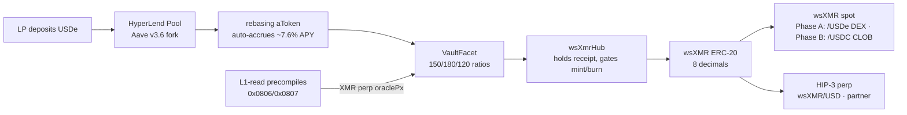
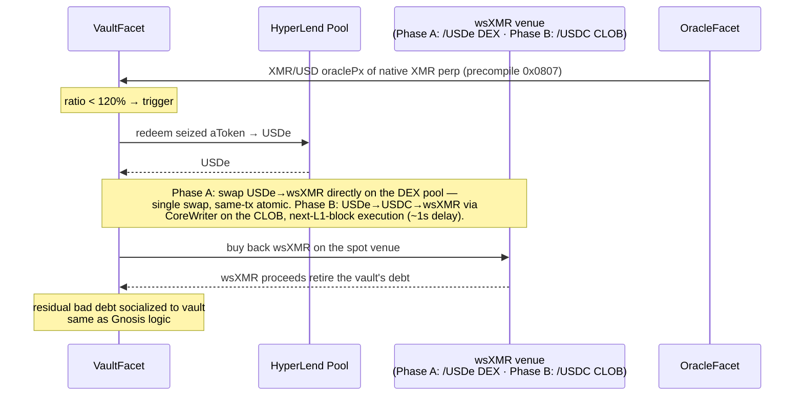

# WrapSynth HyperEVM Migration Spec

**Status:** Draft · September 2026
**Target chain:** HyperEVM (Hyperliquid L1), ChainID `999`, RPC `https://rpc.hyperliquid.xyz/evm`
**Canonical deployment:** replaces the Gnosis Chain beta as the primary venue once live

This document specifies the port of WrapSynth from Gnosis Chain (sDAI collateral, push oracle, Uniswap V3 co-LP) to HyperEVM (USDe collateral via HyperLend, native XMR perp oracle via L1-read precompiles, phased venue: HyperEVM DEX pool at launch → HIP-1 CLOB later, partner-deployed HIP-3 perp). The architecture, security model, and Ed25519 atomic-swap settlement logic are preserved unchanged; only the collateral, oracle, and liquidity-routing layers are swapped.

---

## 1. Why migrate

### 1.1 What we keep
- **Hub + facet (Diamond, EIP-2535) architecture.** `wsXmrHub` continues to own all state and collateral; facets remain stateless and dispatch via the selector table. EIP-1153 transient-storage delegate-context flags are unchanged.
- **Ed25519 on-chain verification.** Mint/burn settlement still binds to Monero-side key material via `scalarMultBase(secret)` checked against the user's claim commitment.
- **Mint → trade → burn lifecycle.** `initiateMint` → `setMintReady` → `revealSecret` → `finalizeMint`; `requestBurn` → `confirmMoneroLock` → `finalizeBurn` / `abortBurn` / `forceSettleBurn`.
- **Griefing-deposit + timeout-based slashing.** Identical economic protection on both sides of the swap.
- **`lockHub()` / `lockDeployer()` one-way admin lock.** Deployer key is permanently powerless once setup completes, same as the live Gnosis v6.1 deployment.
- **LP server (`lp-server-js/`).** Event monitor, Monero RPC, quote pricing, REST API. Chain-agnostic; only RPC URL and contract addresses change.

### 1.2 What we replace
| Component | Gnosis (current) | HyperEVM (target) |
|---|---|---|
| Collateral | sDAI (Savings DAI, MakerDAO DSR) | USDe supplied to HyperLend (Aave v3.6 fork — largest lending market on HyperEVM) |
| YieldFacet yield source | DSR harvested from MakerDAO pot | HyperLend USDe supply APY (~7.6% as of Sep 2026, accrued via rebasing aToken) |
| Oracle | `SimpleOracleFacet` — push oracle, off-chain updater posts RedStone-derived prices | `HyperCoreOracleFacet` reads the **existing native XMR perp's** `oraclePx` via L1-read precompile `0x0807` — validator-maintained, no pusher at all (§4) |
| Trading venue | Uniswap V3 wsXMR/sDAI spot pool | **Phase A:** wsXMR/USDe pool on HyperSwap V3 (free, collateral asset doubles as quote like sDAI did). **Phase B:** HIP-1 wsXMR/USDC on HyperCore CLOB (CLOB mandates USDC quote). HIP-3 wsXMR/USD perp via partner, off critical path |
| Co-LP liquidity router | `wsXMRLiquidityRouter` (UniV3 concentrated liquidity) | **Phase A:** same router ported to a V3-fork pool (near-zero changes). **Phase B:** `HyperCoreLiquidityRouter` posts laddered orders via CoreWriter |
| Liquidation path | seize sDAI → sell on UniV3 wsXMR/sDAI | **Phase A:** seize aToken → redeem USDe → buy back wsXMR directly on the wsXMR/USDe pool — single swap, same-tx atomic (identical shape to Gnosis). **Phase B:** USDe→USDC→wsXMR via CoreWriter on the CLOB (next-L1-block) |
| Settlement finality | ~5s blocks (Gnosis) | sub-second (HyperBFT) |
| Collateral ratios | 150% min / 180% target / 120% liq | Unchanged: 150% min / 180% target / 120% liq |

### 1.3 What this unlocks
1. **XMR/USD perp exposure via HIP-3 — through a partner deployer.** An existing HIP-3 deployer (already staked, already running oracle infrastructure) can list a wsXMR/USD perp on their DEX — no 500k HYPE stake and no 24/7 `setOracle` duty for WrapSynth. wsXMR graduates from a wrapped spot token to a leverage-bearing derivative. Self-deploying remains an option later (500k HYPE stake + deployer-operated oracle).
2. **Native oracle with genuinely no off-chain pusher.** A native validator-run XMR perp already exists on HyperCore (XMR-USDC, live since Jan 2026). Its `oraclePx` — maintained by the validator set from external CEX feeds — is readable from HyperEVM via the `0x0807` precompile in every block, for free. This retires the "oracle liveness depends on the off-chain price pusher" risk outright; WrapSynth operates no price infrastructure.
3. **Free launch venue, paid upgrade path.** Phase A trades on a HyperSwap V3 pool (free pool creation, existing UniV3 router ports directly). Phase B upgrades to the HyperCore CLOB via HIP-1 when treasury allows — HyperCore and HyperEVM share HyperBFT consensus and global state, so the linked wsXMR is the same asset on both layers, no third-party bridge (§5.1).
4. **Phase B: CLOB liquidations instead of AMM dumps.** In Phase B, `LiquidationFacet` uses CoreWriter to buy back wsXMR on the HyperCore spot book — no AMM slippage, smaller MEV surface. Phase A liquidations use the DEX pool, which is actually *simpler* mechanically (same-tx atomic vs. CoreWriter's next-block delay) — the CLOB's advantage is depth, not mechanics.
5. **Finance-native user base.** Hyperliquid's traders are the target audience for a synthetic-XMR product. The HIP-3 wave (gold, silver, TSLA, NVDA perps) demonstrates active demand for non-ETH/BTC asset classes on the platform.

---

## 2. Architecture

### 2.1 High-level

```
                      ┌────────────────────────────────┐
                      │           wsXmrHub             │
                      │  state · collateral · token     │
                      │  selector → facet dispatch      │
                      │  EIP-1153 delegate context      │
                      └──────────┬─────────────────────┘
        ┌──────────┬─────────┬───┴────┬───────────┬──────────┐
   VaultFacet  MintFacet  BurnFacet  Liquidation  YieldFacet  OracleFacet
   (USDe+HyperLend) (same) (same)    Facet       (HyperLend) (HyperCore
                                                       precompile)
        │                                            │
        ▼                                            ▼
   ┌─────────────┐                          ┌──────────────────┐
   │ HyperLend   │                          │ L1-read          │
   │ (Aave v3.6) │ ←─ USDe yield            │ precompiles      │
   │             │                          │ 0x0806/07/08     │
   └─────────────┘                          │ XMR/USD (native  │
                                            │  XMR perp)       │
                                             └──────────────────┘
                                                          ▲
                                                          │ reads
   ┌──────────────────────────────────────────────────────┘
   │
   ▼
   ┌──────────────────────────────────────────────────┐
   │ Trading venue                                    │
   │  · Phase A: HyperSwap V3 wsXMR/USDe pool —       │
   │    free, existing UniV3 router ports directly    │
   │  · Phase B: HIP-1 wsXMR/USDC on HyperCore CLOB   │
   │  · HIP-3 wsXMR/USD perp (partner, off crit path) │
   └──────────────────────────────────────────────────┘
```

### 2.2 Collateral flow



### 2.3 Liquidation flow



---

## 3. Collateral: USDe on HyperLend

### 3.1 Why USDe

The previous Gnosis design uses sDAI to satisfy four requirements simultaneously: stable unit of account, yield-bearing, deep liquidity, no centralized issuer with freeze power. After USDH was sunset (May 2026, Native Markets sold to Coinbase) and USDC was ruled out for WrapSynth's use case (Circle's `freeze(address)` / OFAC `blacklist(address)` powers at the token-contract level create a permanent, unrecoverable failure mode that's specifically likely to be invoked against a Monero-on-ramp protocol), the only HyperEVM asset that satisfies all four is **USDe**.

| Property | USDe | sDAI (baseline) |
|---|---|---|
| Peg | USD 1:1 (delta-neutral ETH/stETH + short perp) | USD 1:1 (MakerDAO) |
| Issuer | Ethena Labs (not a regulated US money transmitter) | MakerDAO (decentralized governance) |
| `freeze(address)` power | None | None |
| Yield mechanism | Funding-rate arbitrage + lending-market supply APY | DSR (governance-set) |
| Yield (current) | ~5–7% direct USDe accrual + ~7.6% on HyperLend | ~5–6% DSR |
| Audited venue | HyperLend (Aave v3.6 fork — battle-tested codebase) | MakerDAO (most-audited protocol in DeFi) |
| Stress-test history | Held through April 2025 JELLY incident, peg stayed within ~30bps | Held through multiple crypto crises |

The relevant risk property: USDe's tail risk is **market risk** (funding-rate dislocation → temporary depeg, recoverable via arb), not **censorship risk** (permanent freeze, non-recoverable). For a privacy-asset protocol whose thesis is "no trusted intermediary," market risk is the structurally correct kind of risk to carry. Additionally, USDe's funding-stress scenario is correlated with crypto-wide volatility, while XMR tends to hold or appreciate during such episodes (flight-to-privacy-asset dynamic) — meaning the protocol's collateral stress and liability stress are *inversely* correlated, a favorable structural property.

### 3.2 Why HyperLend as the yield layer

HyperLend is the largest lending market on HyperEVM — an Aave v3.6 fork with a live USDe reserve (verified on-chain Sep 2026: aToken `0x333819c04975554260AaC119948562a0E24C2bd6`, ~7.6% supply rate). Borrow demand is driven organically by Hyperliquid perp traders using USDe as margin.

**Why not HypurrFi Prime (the earlier draft's choice):** HypurrFi is winding down — Euler is absorbing its Mewler markets in-house, pooled markets are being sunset, and **no USDe vault exists in the Mewler EVK factory** (all 58 vaults checked on-chain). The earlier draft's primary venue doesn't actually have the market it assumed.

Alternative venues considered:
- **Euler/Mewler EVK vault** — a USDe vault could be created permissionlessly via `eVaultFactory` (`0xcF5552580fD364cdBBFcB5Ae345f75674c59273A`), but bootstrapping a fresh isolated vault means thin liquidity and no borrow demand at launch. Kept as a secondary venue; see §3.5.
- **Felix Vanilla USDe** — Morpho-powered, Liquity V2 lineage; not yet live for USDe as of Sep 2026.
- **Raw USDe held in wsXmrHub (no lending market)** — simpler, no protocol-risk layer, but forfeits ~5–7% APY. Used for the 10% instant-liquidity buffer (§3.4).

### 3.3 Receipt token accounting

HyperLend issues an Aave v3 **rebasing aToken** for USDe deposits — `balanceOf()` returns the USDe-denominated balance including accrued interest, growing monotonically. This is *simpler* than the sDAI shares model: there is no share/asset exchange rate to track, the aToken balance IS the USDe-equivalent collateral value. `YieldFacet` reads `aToken.balanceOf(hub)` directly.

The audit-fixed "yield harvesting unit mismatch between sDAI shares and DAI amounts" finding from the Gnosis review still applies in spirit: vault accounting must consistently use the aToken's *current* balance (post-rebase), never a cached or scaled figure. Note `scaledBalanceOf()` returns the non-rebased principal — do not use it for collateral valuation.

### 3.4 Buffer policy

10% of each vault's collateral is held as **raw USDe directly in `wsXmrHub`** (not supplied to HyperLend). This ensures `forceSettleBurn` and `finalizeBurn` paths that need immediate collateral release are not blocked by HyperLend withdrawal latency or utilization spikes. The remaining 90% is supplied to HyperLend to capture yield.

**Sizing note:** 10% is a floor, not a target. The buffer should be `max(10%, expected 24h burn volume + margin)` — a single large burn can exceed 10% of one vault. Aave v3 withdrawals are normally instant; the real failure mode is utilization spiking toward 100%, so the LP server should monitor HyperLend USDe utilization and top up the buffer proactively rather than discovering the shortfall mid-burn.

The split is enforced in `VaultFacet.deposit()` and `VaultFacet.rebalance()` — not a configurable LP preference. This mirrors the Gnosis design where the hub is the canonical collateral holder and the sDAI position is a yield deployment of that collateral.

### 3.5 Fallback venue

If HyperLend experiences a pause, an audit finding, or sustained withdrawal queue, `VaultFacet` has a secondary deployment path to an Euler/Mewler EVK USDe vault (created via `eVaultFactory` if none exists yet) or raw-USDe-only mode. This is implemented as a configurable `yieldVenue` address per vault, settable only by the LP who owns the vault. **Accounting caveat:** venue-agnostic accounting must handle both models — Aave aTokens rebase (`balanceOf` grows), while EVK vaults are ERC-4626 (`convertToAssets`). The `yieldVenue` abstraction needs a per-venue adapter, not a single accounting path.

---

## 4. Oracle: native XMR perp via L1-read precompile

### 4.1 Why this finally retires the pusher

The Gnosis deployment uses `SimpleOracleFacet` — a push oracle where an off-chain updater posts RedStone-derived XMR/USD prices on a schedule, guarded by an on-chain deviation limit and an EMA. The README's "Honest risk disclosure" flags this: *"Oracle liveness depends on the off-chain price pusher."*

On HyperEVM the pusher is genuinely gone — **not because we run it somewhere else, but because Hyperliquid's validators already run one.** A native validator-operated XMR perp (XMR-USDC) has existed on HyperCore since January 2026. Its `oraclePx` is maintained by the validator set from external CEX feeds — the same class of feed that secures every native perp on the venue. HyperEVM contracts read it via the L1-read precompiles in every block, for free, with no WrapSynth-operated infrastructure:

| Precompile | Returns |
|---|---|
| `0x0000000000000000000000000000000000000806` | `markPx(perpIndex)` |
| `0x0000000000000000000000000000000000000807` | `oraclePx(perpIndex)` |
| `0x0000000000000000000000000000000000000808` | `spotPx(spotIndex)` |

**Critical design rule: never use the wsXMR spot venue price for collateral ratios.** The wsXMR price on a fresh venue — Phase A DEX pool or Phase B CLOB book — is not XMR/USD; it's whatever thin liquidity prints, and it's reflexive (pump wsXMR → inflated collateral ratios → mint more → dump). Collateral checks use the *native XMR perp's* `oraclePx` — an exogenous feed whose liveness is Hyperliquid's problem, not ours.

### 4.2 `HyperCoreOracleFacet` (replaces `SimpleOracleFacet`)

```solidity
// SPDX-License-Identifier: MIT
pragma solidity ^0.8.28;

/// @notice Reads XMR/USD from HyperEVM L1-read precompiles.
/// @dev    IMPORTANT: precompiles take RAW ABI-encoded arguments —
///         no 4-byte function selector. A Solidity interface call
///         would prepend a selector and fail. Use low-level
///         staticcall(abi.encode(index)) as below.
///         Perp prices return uint64 scaled by 10^(6 - szDecimals).
///         Precompiles revert (consuming call-frame gas) on invalid
///         input — validate perpIndex at construction.
contract HyperCoreOracleFacet {
    address constant MARK_PX   = 0x0000000000000000000000000000000000000806;
    address constant ORACLE_PX = 0x0000000000000000000000000000000000000807;

    /// @dev Perp index of the NATIVE validator-run XMR perp on
    ///      HyperCore — known before deployment, no dependency on
    ///      any wsXMR listing.
    uint32 public immutable xmrPerpIndex;

    constructor(uint32 _xmrPerpIndex) {
        xmrPerpIndex = _xmrPerpIndex;
    }

    function _readPx(address precompile, uint32 idx) internal view returns (uint64) {
        (bool ok, bytes memory out) = precompile.staticcall(abi.encode(idx));
        require(ok, "L1 precompile read failed");
        return abi.decode(out, (uint64));
    }

    /// @notice Price used for collateral ratio checks.
    ///         oraclePx is the exogenous validator-maintained XMR/USD
    ///         feed. When oracle and mark diverge >2%, return the
    ///         HIGHER price — XMR/USD values the wsXMR debt, so the
    ///         conservative choice for vault solvency is the one
    ///         that makes debt look largest.
    function collateralPrice() external view returns (uint256) {
        uint256 oracle = uint256(_readPx(ORACLE_PX, xmrPerpIndex));
        uint256 mark   = uint256(_readPx(MARK_PX, xmrPerpIndex));
        require(oracle > 0, "oracle price unavailable");
        if (mark == 0) return oracle;
        uint256 ratio = oracle > mark ? (oracle * 1e18) / mark : (mark * 1e18) / oracle;
        if (ratio <= 1.02e18) return oracle;
        return oracle > mark ? oracle : mark; // diverged: conservative max
    }
}
```

### 4.3 What changed vs. the earlier draft

- **No phased migration needed.** The earlier draft assumed the only XMR/USD feed on HyperCore would be our own HIP-3 wsXMR perp — which meant a push-oracle interim and a deployer-operated oracle forever. The existing native XMR perp removes both: `HyperCoreOracleFacet` works from day one and WrapSynth never operates price infrastructure.
- **The HIP-3 wsXMR perp becomes a pure liquidity/leverage decision** (§5.1) — the oracle does not depend on it.
- **Residual dependency, honestly stated:** the feed's liveness is now a Hyperliquid platform dependency. If validators delist or halt the native XMR perp, `collateralPrice` reverts → mints and liquidations pause. **Verified in `BurnFacet`:** `requestBurn` also reads the oracle (par pricing for the collateral lock), so new burn requests pause too — but in-flight burns settle on `xmrPriceAtRequest` fixed at request time, and `_syncVaultYield` already skips stale-oracle calls rather than blocking. Net effect of an oracle outage: new mints/burns/liquidations pause, in-flight settlements complete. Acceptable, but disclosed (§11).

---

## 5. Trading venue: phased — HyperEVM DEX first, HyperCore CLOB later

### 5.0 The phasing decision

The original plan assumed HIP-1 (HyperCore CLOB listing) at launch. That costs a Dutch auction (floor 500 HYPE, realistically more) — capital the treasury doesn't have. **Revised plan:**

- **Phase A (launch):** wsXMR/**USDe** pool on **HyperSwap V3** — the largest DEX on HyperEVM, a UniV3 fork with verified contracts (§6.2). Free pool creation, same architecture as Gnosis (where the collateral asset sDAI doubled as the quote), and the existing `wsXMRLiquidityRouter` ports almost directly (it's already a UniV3 concentrated-liquidity router). Liquidations are a **single swap** — seize → redeem USDe → buy wsXMR — same-tx atomic, no USDC leg at all. USDC only enters the design in Phase B, where the CLOB mandates it as the quote asset.
- **Phase B (when treasury allows):** win the HIP-1 auction, link the ERC-20, migrate the trading venue and liquidation path to the HyperCore CLOB per §5.1–5.3. The contract stack is unchanged — only the router and liquidation venue swap.
- **HIP-3 perp:** unchanged — partner-deployed, off the critical path entirely.

What Phase A still gets you vs. staying on Gnosis: the free validator-run XMR oracle (no pusher), HyperLend yield on USDe, HyperEVM ecosystem access, and a clean upgrade path to the CLOB. What it doesn't get you: HyperCore's deeper liquidity and native venue — that's the Phase B payoff.

### 5.1 Phase B: HIP-1 spot listing on HyperCore CLOB

*(Deferred — kept here as the complete spec for when treasury allows.)*

The Gnosis deployment's `wsXMRLiquidityRouter` deploys vault collateral as Uniswap V3 concentrated liquidity in the wsXMR/sDAI pool. In Phase B this is replaced by two HyperCore listings:

**HIP-1 spot listing: wsXMR/USDC**
- wsXMR is deployed as a HIP-1 native token on HyperCore, linked 1:1 to its ERC-20 form on HyperEVM. **Dynamic mint/burn is confirmed compatible** — the docs explicitly support HyperEVM-minted ERC-20s (the standard bridged-asset pattern). Mechanics:
  - Each token's system address is `0x20` + token index (big-endian), e.g. `0x2000…00c8` for index 200. (`0x2222…2222` is HYPE's system address only — an earlier draft had this wrong.)
  - **EVM→Core:** ERC-20 `transfer` to the system address → Core credits the sender 1:1 off the `Transfer` event. No supply checks — any amount the hub mints can flow to Core.
  - **Core→EVM:** `sendAsset` to the system address → a system transaction calls `transfer(recipient, amount)` on the ERC-20 *as the system address*, paying out of its escrowed balance.
  - **Genesis:** deployer seeds the system address's Core-side balance with max supply (`2^64-1` recommended for minted assets).
  - **Linking finalization:** if wsXMR is deployed by a contract (e.g. `Create2Deployer`), the ERC-20's first storage slot or the slot at `keccak256("HyperCore deployer")` must hold a finalizer EOA address — reserve this slot in `wsXMR.sol`.
  - **Dust:** non-round amounts (below `extraEvmWeiDecimals` precision) are burned on transfer — irrelevant at 8 decimals but covered by tests.
- **HIP-1 deployment is a permissionless Dutch auction** (31h, floor 500 HYPE — the reason it's deferred to Phase B). Treat the `wsXMR` ticker as front-runnable by squatters until won.
- The spot pair quotes against USDC, the canonical HyperCore quote asset.
- **HIP-2 Hyperliquidity caveat:** deployers of minted/bridged assets typically set `noHyperliquidity` — HIP-2's supply assumptions conflict with a `2^64-1` system-address seed. Assume wsXMR liquidity comes from the router's laddered orders (§5.2), not HIP-2 auto-seeding; revisit if Hyperliquidity proves compatible on testnet.

**HIP-3 perp listing: wsXMR/USD — via a partner deployer**
- **Recommended path: partner with an existing HIP-3 deployer.** Several deployers already hold the 500k HYPE stake and operate `setOracle` infrastructure (e.g. the Based/HyENA deployer). A wsXMR/USD perp on their DEX gives WrapSynth the leverage venue with **no stake, no oracle duty, no slashing exposure** — the partner runs `setOracle` (~every 3s), sets margin tables, and carries the operational burden. Negotiate fee-share and market parameters contractually.
- **Self-deploy remains the fallback:** 500k HYPE stake (locked ≥183 days, slashable during the 7-day unstaking queue), first 3 markets free then Dutch auction per slot, deployer operates the oracle 24/7, validators review >50% daily `externalPerpPx` moves for manipulation. Only worth it if partner terms are bad or fee-share justifies the capital.
- **The oracle no longer depends on this listing** (§4) — the native XMR perp's `oraclePx` serves collateral accounting regardless. The HIP-3 market is purely a liquidity/leverage venue, which is why partnering is acceptable: we don't need deployer privileges, we need the market to exist.
- Inherits HyperCore's matching engine, margining, and liquidation infrastructure — no perp engine needs to be built.
- Up to 50% of trading fees flow to the deployer (the partner, in the recommended path — negotiate a share).

### 5.2 Liquidity router — two variants

**Phase A: `wsXMRLiquidityRouter` ports almost unchanged.** The existing UniV3 concentrated-liquidity router targets a V3-fork pool (Kittenswap/HyperSwap V3) on HyperEVM — same tick math, same position management, only the pool factory address and quoter/swap-router addresses change. This is the cheapest possible port: the contract is already written and audited.

**Phase B: `HyperCoreLiquidityRouter` (replaces it).** The new router does not manage AMM positions. Instead, it:

1. **Wraps vault USDe → USDC** for the spot pair's quote side (transient, only when seeding spot liquidity).
2. **Deploys wsXMR + USDC into the HyperCore wsXMR/USDC spot book** via CoreWriter, using laddered limit orders as a substitute for concentrated liquidity ranges. LPs specify a price range and tick spacing analogous to UniV3 ticks; the router posts resting orders across that range.
3. **Optionally supports the HIP-3 perp** — in the partner-deployed path there is no WrapSynth stake at all; the router only needs to route orders to the partner DEX's asset index. Self-deploy would be a treasury-level decision independent of any vault.
4. **Rebalances resting orders** as price moves, using CoreWriter's batch order-update calls.

This is a simpler primitive than UniV3 concentrated liquidity (no ticks, no fee tiers, no NFT position manager) but achieves the same economic effect: vault collateral is deployed as liquidity in the wsXMR/USDC pair, earning maker fees instead of sitting idle.

### 5.3 CoreWriter integration

CoreWriter (fixed address `0x3333333333333333333333333333333333333333`, live since July 2025) allows HyperEVM smart contracts to write to HyperCore state — place/cancel orders, transfer spot assets, manage stakes. Actions are queued and execute on a subsequent L1 block (~1s), which bounds front-running but means **nothing is same-block atomic** — liquidation and rebalancing logic must tolerate the delay. The `HyperCoreLiquidityRouter` and `LiquidationFacet` both use CoreWriter calls.

**Action encoding** (verified against Hyperliquid docs): `sendRawAction(bytes)` where the payload is `version(1 byte = 0x01) ++ actionId(3 bytes, big-endian) ++ abi.encode(action args)`. ~47k gas per call; order/vault actions are delayed a few seconds on-chain (anti-latency-arb) and appear twice in the explorer (enqueue → execute).

Action IDs used by WrapSynth:

| ID | Action | Args (ABI types) | Use |
|---|---|---|---|
| 1 | Limit order | `(uint32 asset, bool isBuy, uint64 limitPx, uint64 sz, bool reduceOnly, uint8 tif, uint128 cloid)` | Router laddered orders + liquidation buyback. `tif`: 1=ALO, 2=GTC, 3=IOC. `limitPx`/`sz` are `10^8 ×` human value |
| 6 | Spot send | `(address dest, uint64 token, uint64 wei)` | Move wsXMR/USDC between EVM and Core accounts |
| 10 | Cancel by oid | `(uint32 asset, uint64 oid)` | Pull stale router orders |
| 11 | Cancel by cloid | `(uint32 asset, uint128 cloid)` | Same, by client order id |
| 13 | Send asset | `(address dest, address subAccount, uint32 srcDex, uint32 dstDex, uint64 token, uint64 wei)` | Cross-DEX/spot transfers (`uint32::MAX` = spot) |
| 8 | Finalize EVM contract | `(uint64 token, uint8 variant, uint64 createNonce)` | HIP-1↔ERC-20 linking finalization (§5.1). `variant`: 1=Create, 2=FirstStorageSlot, 3=CustomStorageSlot |

Note: USDC's EVM→Core path is special — its linked contract is Circle's `CoreDepositWallet` (`0x6b9e773128f453f5c2c60935ee2de2cbc5390a24`), so USDC deposits use `deposit(amount, 2^32-1)` after `approve`, not a plain system-address transfer. wsXMR uses the standard system-address path.

---

## 6. Contracts to port

### 6.1 Files changed

| File | Change | Notes |
|---|---|---|
| `ethereum/contracts/core/wsXmrHub.sol` | Address constants, no logic change | New ChainID, new token address |
| `ethereum/contracts/core/wsXmrStorage.sol` | Collateral token address: sDAI → HyperLend USDe aToken | Storage layout unchanged |
| `ethereum/contracts/wsXMR.sol` | Reserve finalizer storage slot for HIP-1 linking | First slot or `keccak256("HyperCore deployer")` slot must hold finalizer EOA if deployed via contract (§5.1) |
| `ethereum/contracts/Ed25519.sol` | None | Ed25519 scalar mult, chain-agnostic |
| `ethereum/contracts/facets/VaultFacet.sol` | Collateral token address, buffer split logic (§3.4), aToken accounting | Ratio parameters unchanged: 150/180/120 |
| `ethereum/contracts/facets/MintFacet.sol` | None | Ed25519 flow unchanged |
| `ethereum/contracts/facets/BurnFacet.sol` | None | Ed25519 flow unchanged |
| `ethereum/contracts/facets/LiquidationFacet.sol` | Liquidation path: redeem aToken → USDe → USDC → buy back wsXMR. Phase A: DEX swap (same-tx). Phase B: CoreWriter CLOB (next-block) | Venue-agnostic via configurable swap adapter |
| `ethereum/contracts/facets/YieldFacet.sol` | Yield source: DSR pot → HyperLend aToken rebasing balance | Simpler (auto-accrual via `balanceOf`, no harvest call, no exchange rate) |
| `ethereum/contracts/facets/SimpleOracleFacet.sol` | **Replaced** by `HyperCoreOracleFacet.sol` at launch | Native XMR perp oracle exists — no push-oracle phase needed |
| `ethereum/contracts/facets/HyperCoreOracleFacet.sol` | **New file** | Per §4.2 — raw `staticcall`, no selector |
| `ethereum/contracts/router/wsXMRLiquidityRouter.sol` | **Phase A:** port to V3-fork pool (factory/quoter/router addresses only). **Phase B:** replaced by `HyperCoreLiquidityRouter.sol` | Phase A is near-zero-change; Phase B is new impl per §5.2 |
| `deployment.json` | New addresses, new external contracts | — |

**Port precondition:** confirm the open audit findings on burn/collateral accounting (`finalizeBurn` double-subtraction, `lockedCollateral` semantics, `withdrawCollateral` stale state, `triggerBuyAndBurn` debt forgiveness) are fixed on Gnosis before porting — "no logic change" must not mean "ports known bugs."

### 6.2 New external dependencies

| Contract | Address (to be set at deploy) | Purpose |
|---|---|---|
| HyperLend Pool | `0x00A89d7a5A02160f20150EbEA7a2b5E4879A1A8b` | Yield venue — Aave v3.6 fork, `supply`/`withdraw` USDe |
| HyperLend USDe aToken | `0x333819c04975554260AaC119948562a0E24C2bd6` | Rebasing receipt — `balanceOf` = USDe collateral value |
| USDe (Ethena OFT) | `0x5d3a1Ff2b6BAb83b63cd9AD0787074081a52ef34` | Canonical LayerZero OFT deployment — resolves the provenance question (§10.1) |
| USDC (native Circle) | `0xb88339CB7199b77E23DB6E890353E22632Ba630f` | Transient quote asset for liquidations (testnet: `0x2B3370eE501B4a559b57D449569354196457D8Ab`) |
| USDC CoreDepositWallet | `0x6b9e773128f453f5c2c60935ee2de2cbc5390a24` | USDC EVM→Core deposits use `deposit()`, not system-address transfer |
| Euler/Mewler eVaultFactory | `0xcF5552580fD364cdBBFcB5Ae345f75674c59273A` | Fallback yield venue — permissionless EVK vault creation (§3.5) |
| HyperSwap V3 Factory | `0xB1c0fa0B789320044A6F623cFe5eBda9562602E3` | Phase A venue — `createPool` permissionless, verified on-chain |
| HyperSwap SwapRouter02 | `0x6D99e7f6747AF2cDbB5164b6DD50e40D4fDe1e77` | Phase A swaps + liquidation path |
| HyperSwap NFPM | `0x6eDA206207c09e5428F281761DdC0D300851fBC8` | Phase A LP positions (concentrated liquidity NFTs) |
| HyperSwap QuoterV2 | `0x03A918028f22D9E1473B7959C927AD7425A45C7C` | Off-chain quote simulation for liquidation sizing |
| L1-read precompiles | `0x…0806` (markPx), `0x…0807` (oraclePx), `0x…0808` (spotPx) | XMR/USD reads — raw ABI args, no selector |
| wsXMR system address | `0x20` + HIP-1 token index (big-endian), set post-auction | wsXMR ERC-20 ↔ Core spot transfers. NOTE: `0x2222…2222` is HYPE's address only |
| CoreWriter | `0x3333333333333333333333333333333333333333` | Order writes to HyperCore |

---

## 7. LP node changes

The LP server (`lp-server-js/`, JavaScript — the Rust node lives in a separate repo and is out of scope here) is largely chain-agnostic. Required changes:

1. **RPC URL:** `https://rpc.hyperliquid.xyz/evm` (ChainID 999).
2. **Contract addresses:** updated from `deployment.json`.
3. **Oracle monitoring:** remove the price-pusher health check entirely — no WrapSynth price infrastructure exists. Add a precompile freshness check (verify `oraclePx(xmrPerpIndex)` changes across blocks) and alert on native-XMR-perp halt/delist news.
4. **Liquidation bot:** Phase A needs no new awareness — the bot calls `LiquidationFacet.liquidate(vaultId)` and the DEX swap happens same-tx, identical to the Gnosis flow. Phase B adds CoreWriter's next-block execution semantics.
5. **Monero RPC:** unchanged. The XMR payment flow is off-chain and identical to Gnosis.
6. **Gas token:** HYPE instead of xDAI. Treasury needs to hold HYPE for gas; this is a new operational line item (see §10.2).

---

## 8. Deployment procedure

**Scope note — what's actually required.** The contract stack (hub, facets, wsXMR, `HyperCoreOracleFacet`, HyperLend collateral) is pure HyperEVM and functions with **no HIP-1/HIP-3 listing at all** — the oracle reads the *native* XMR perp, which exists regardless of anything we deploy. With the phased venue plan (§5.0), **HIP-1 is fully off the critical path**: Phase A launches on a free HyperEVM DEX pool, liquidations route through it same-tx, and the HIP-1 auction (~500+ HYPE) is deferred to Phase B when treasury allows. The only HyperCore dependency at launch is the *read-side* oracle — which is free.

### 8.1 Pre-deploy

0. **HyperEVM testnet pass first.** Deploy the full hub + facet stack on HyperEVM testnet and run the ported E2E suites before any mainnet step below.
1. **Acquire HYPE for gas** (treasury operational reserve — Phase A needs only gas, ~10–50 HYPE; no auction cost).
2. **Confirm HyperLend USDe reserve** is live and has sufficient supply cap for expected LP collateral volume (Pool `0x00A89d7a5A02160f20150EbEA7a2b5E4879A1A8b`, aToken `0x333819c04975554260AaC119948562a0E24C2bd6` — verified Sep 2026).
3. **Record the native XMR perp index** for `HyperCoreOracleFacet` — **mainnet `224`, testnet `202`** (verified via `meta` API + live `0x0807` precompile read, Sep 2026; re-verify at deploy since indices are per-network and can change). No dependency on any wsXMR listing.
4. **Phase A DEX confirmed: HyperSwap V3** — factory `0xB1c0fa0B789320044A6F623cFe5eBda9562602E3`, SwapRouter02 `0x6D99e7f6747AF2cDbB5164b6DD50e40D4fDe1e77`, NFPM `0x6eDA206207c09e5428F281761DdC0D300851fBC8`, QuoterV2 `0x03A918028f22D9E1473B7959C927AD7425A45C7C` (all verified on-chain Sep 2026: `feeAmountTickSpacing(3000)=60`, router+NFPM `factory()` back-reference confirmed). `createPool` is permissionless.
5. **Phase B items (deferred, not blockers):** HIP-1 Dutch auction for the wsXMR slot (test the deploy+link flow on testnet first — `app.hyperliquid-testnet.xyz/deploySpot`); HIP-3 partner-deployer conversation.

### 8.2 Deploy sequence

Foundry scripts, same convention as `deploy.sh` / `script/DeployGnosis.s.sol` — granular `.s.sol` scripts, `forge script … --broadcast --legacy`:

```bash
export HYPEREVM_RPC=https://rpc.hyperliquid.xyz/evm

# 1. Deploy wsXMR ERC-20 (8 decimals) + wsXmrHub + all facets + register
forge script script/DeployHyperEVM.s.sol:DeployHyperEVM \
    --rpc-url $HYPEREVM_RPC --broadcast --legacy
#    Deploys: wsXMR, wsXmrHub, VaultFacet, MintFacet, BurnFacet,
#             LiquidationFacet, YieldFacet, HyperCoreOracleFacet;
#    registers facets on hub (mirrors DeployGnosis.s.sol structure)

# 2. Deploy liquidity router (Phase A: ported UniV3 router → HyperSwap V3)
forge script script/DeployRouter.s.sol:DeployRouter \
    --rpc-url $HYPEREVM_RPC --broadcast --legacy
#    Reads factory/router/quoter/NFPM from deploymentConfig:
#    0xB1c0fa0B… / 0x6D99e7f6… / 0x03A91802… / 0x6eDA2062…

# 3. Configure oracle — set the native XMR perp index (224 mainnet)
forge script script/SetupOracle.s.sol:SetupOracle \
    --rpc-url $HYPEREVM_RPC --broadcast --legacy

# 4. Configure collateral (HyperLend pool + USDe aToken)
forge script script/SetupCollateral.s.sol:SetupCollateral \
    --rpc-url $HYPEREVM_RPC --broadcast --legacy
#    USDe 0x5d3a1Ff2… · Pool 0x00A89d7a… · aToken 0x333819c0…

# 5. Create wsXMR/USDe pool on HyperSwap V3 + seed initial LP position
forge script script/InitPool.s.sol:InitPool \
    --rpc-url $HYPEREVM_RPC --broadcast --legacy

# 6. Lock deployer (irreversible — same as Gnosis v6.1)
forge script script/LockDeployer.s.sol:LockDeployer \
    --rpc-url $HYPEREVM_RPC --broadcast --legacy

# 7. [Phase B, when treasury allows] HIP-1 auction → link ERC-20 →
#    deploy HyperCoreLiquidityRouter → migrate liquidation venue to CLOB.
#    [Post-launch, off critical path] wsXMR/USD perp via partner HIP-3
#    deployer — no stake or oracle infra needed from WrapSynth.

# 8. Final verification (read-only, no --broadcast)
forge script script/VerifyDeployment.s.sol:VerifyDeployment \
    --rpc-url $HYPEREVM_RPC
```

### 8.3 Post-deploy verification

- [ ] `hubLocked() == true` on wsXmrHub
- [ ] `deployerOperationsLocked() == true` on wsXmrHub
- [ ] `wsXMR.hub() == wsXmrHub` (token points to hub, not deployer)
- [ ] All facets registered and callable via hub dispatch
- [ ] `HyperCoreOracleFacet.collateralPrice()` returns non-zero matching the native XMR perp's `oraclePx`
- [ ] `VaultFacet.deposit(USDe, amount)` succeeds and issues HyperLend aTokens to the hub
- [ ] `YieldFacet.yieldAccrued(vaultId)` returns non-zero after ≥1 block
- [ ] wsXMR/USDe pool live on HyperSwap V3; router LP position seeded
- [ ] [Phase B] HIP-1 slot won; ERC-20 → system address → Core spot transfer verified end-to-end; `HyperCoreLiquidityRouter` live
- [ ] [Post-launch] wsXMR/USD HIP-3 perp live on partner DEX
- [ ] End-to-end mint → trade → burn cycle executed on mainnet with a small test amount

---

## 9. Testing

### 9.1 Ported test suites

| Suite | Changes required |
|---|---|
| `BurnSolvencyInvariantTest.t.sol` (633 lines) | Replace sDAI mocks with HyperLend aToken/USDe mocks; replace RedStone oracle mock with HyperCore system-contract mock |
| `AuditRegressionTest.t.sol` | Update yield-unit-mismatch regression to use aToken rebasing-balance/USDe pair instead of sDAI shares/DAI |
| `E2EFullCycle.t.sol` | Update deployment addresses and RPC fork target |
| `E2EComprehensive.t.sol` | Same |
| `E2EAdvancedScenarios.t.sol` | Same |
| `test/CoLPTest*.t.sol` fork tests | Repoint UniV3 fork to the Phase A V3-fork pool on HyperEVM (Phase B: add CLOB fork tests) |

### 9.2 New test suites

- **`HyperCoreOracleFacetTest.t.sol`** — mocked L1-read precompiles return valid/zero/divergent mark+oracle prices; verify raw-staticcall encoding (no selector) and the conservative-max `collateralPrice()` fallback (§4.2).
- **`HyperLendCollateralTest.t.sol`** — USDe supply, aToken rebase accrual, withdrawal-under-utilization, HyperLend pause/freeze scenario.
- **`DexLiquidationTest.t.sol`** — Phase A liquidation path: trigger → aToken redeem → USDe→USDC → wsXMR buyback via mocked V3-fork pool (same-tx semantics, slippage bounds).
- **`CoreWriterLiquidationTest.t.sol`** *(Phase B)* — same path via mocked CoreWriter (next-block semantics).
- **`HyperCoreLiquidityRouterTest.t.sol`** *(Phase B)* — order placement, rebalancing, range management via CoreWriter.
- **`HIP1LinkingTest.t.sol`** *(Phase B)* — ERC-20→system-address→Core credit flow with dynamically minted wsXMR; finalizer-slot linking; dust-burn edge cases (§5.1).
- **`HIP3PartnerTest.t.sol`** — only if self-deploy becomes the chosen path: stake, fee accrual, slashing scenario (simulated).

### 9.3 Foundry fork target

```bash
# Fork HyperEVM mainnet for integration tests
forge test --fork-url https://rpc.hyperliquid.xyz/evm \
           --fork-block-number <recent_block> -vvv
```

HyperEVM is supported by Foundry as a standard EVM chain. No special configuration needed beyond the RPC URL and ChainID 999.

---

## 10. Risks and mitigations

### 10.1 New risks introduced by the migration

| Risk | Severity | Mitigation |
|---|---|---|
| **HyperLend protocol risk** (pause, exploit, Aave v3.6 fork bug) | Medium | 10% raw-USDe buffer in hub (§3.4); fallback to Euler/Mewler EVK vault or raw-USDe mode (§3.5); cap total protocol TVL in HyperLend during initial rollout |
| **USDe depeg** (funding-rate dislocation) | Low–Medium | USDe held through JELLY incident; depeg is temporary and arb-recovers; 150% ratio absorbs ~33% collateral drawdown before liquidation threshold |
| **HIP-3 partner dependency** | Low–Medium | In the partner-deployed path, the wsXMR/USD perp's liveness, oracle quality, and fee terms depend on the partner deployer. Mitigation: contractual SLAs; self-deploy fallback exists but costs 500k HYPE + oracle ops. Slashing risk is the partner's, not ours. |
| **Single-chain concentration** (Hyperliquid L1 halt) | Medium (inherent to the migration) | All contracts, collateral, and settlement are on Hyperliquid L1; a chain halt freezes everything. Disclosed honestly in README. Mitigation: the Gnosis deployment remains as a secondary venue during HyperEVM rollout. |
| **HYPE gas price volatility** | Low | Gas costs are a new operational line item vs. Gnosis (where xDAI is near-free). Treasury holds HYPE reserve; liquidator bots maintain gas balance. |
| **Phase A DEX liquidity depth** | Medium | The launch venue is a fresh HyperEVM DEX pool — same thin-liquidity profile as the Gnosis UniV3 pool. Mitigation: router-seeded LP positions; the CLOB upgrade (Phase B) is the depth fix. |
| **CoreWriter execution delay** *(Phase B)* | Low | Actions execute on a subsequent L1 block (~1s), not same-tx; liquidation and rebalancing logic must tolerate the gap. Not applicable in Phase A (DEX swaps are same-tx). |
| **HIP-1 ticker front-run / auction cost** *(Phase B)* | Low–Medium | Deferred to Phase B — no longer a launch blocker. The `wsXMR` slot is won in a permissionless Dutch auction; assume squatting risk until won (§5.1). |
| **HIP-1↔ERC-20 linking misconfiguration** | Medium | Resolved: dynamic mint IS compatible (§5.1 — no supply checks on EVM→Core). Remaining risk is operational: wrong system-address seed at genesis, missing finalizer slot in `wsXMR.sol`, or stuck multi-stage deployment forfeits auction gas. Mitigation: full testnet dress rehearsal (§8.1 step 0). |
| **Native XMR perp dependency** | Low–Medium | The oracle feed is Hyperliquid's validator-run XMR perp. If validators halt/delist it, `collateralPrice()` fails closed — new mints/burns/liquidations pause; in-flight burns settle on `xmrPriceAtRequest` (verified in `BurnFacet`, §4.3). |
| **Reflexive oracle if spot price used for ratios** | High | Design rule in §4.1: `spotPx` is never used for collateral accounting; only the native XMR perp's `oraclePx`. |
| **USDe bridged-provenance risk** | Low | Resolved: `0x5d3a1Ff2…` is the canonical Ethena LayerZero OFT deployment, not a third-party bridge IOU. Residual risk is LayerZero OFT messaging itself (shared with all OFT chains). |

### 10.2 Operational considerations for the team

- **HYPE treasury management.** Phase A needs HYPE only for gas (~10–50 HYPE operational reserve). Phase B adds the HIP-1 auction (~500+ HYPE). No HIP-3 stake in the partner path. Treasury policy should specify target HYPE holdings and a rebalance cadence.
- **HyperLend monitoring.** Add uptime checks for the HyperLend USDe reserve; alert on utilization >95% (withdrawal friction) or pause/freeze events.
- **Oracle monitoring.** Verify `oraclePx`/`markPx` precompiles return fresh prices each block; alert on stale/zero values and on native-XMR-perp halt/delist announcements. No WrapSynth price infrastructure to operate.
- **HIP-3 partner relationship.** In the partner-deployed path, WrapSynth's operational duty is the relationship itself: fee-share accounting, market-parameter requests, and a contingency plan if the partner halts the market. Self-deploy would add the full 24/7 `setOracle` operator role.

### 10.3 Risks retired by the migration

| Risk (from Gnosis README) | Status on HyperEVM |
|---|---|
| "Oracle liveness depends on the off-chain price pusher" | ✅ Retired — native validator-run XMR perp's `oraclePx` via `0x0807`; WrapSynth operates no price infrastructure |
| "LP-side Monero payment confirmation is an off-chain step" | Unchanged — still economic (collateral slashing), not cryptographic |
| "No formal verification yet" | Unchanged — still applies |
| Thin trading venue (single UniV3 pool on Gnosis) | ⚠️ Improved, not eliminated — HyperCore CLOB + router-seeded liquidity at launch; real depth arrives with the partner HIP-3 perp |
| Collateral freeze risk (would apply if USDC were used) | ✅ Avoided — USDe has no `freeze(address)` function |

---

## 11. Honest risk disclosure (for the README)

> ⚠️ **HyperEVM deployment risks.** In addition to the general risks disclosed in the main README, the HyperEVM deployment introduces:
>
> - **Single-chain concentration.** All WrapSynth contracts, collateral (USDe), and the wsXMR trading venue (HyperCore) operate on Hyperliquid L1. A consensus failure, chain halt, or catastrophic HYPE devaluation on Hyperliquid would impair the protocol's ability to settle mints and burns, even though Monero-side payments are unaffected. The Gnosis Chain deployment remains as a secondary venue during the HyperEVM rollout.
> - **HyperLend protocol dependency.** LP collateral is supplied to HyperLend (Aave v3.6 fork). A HyperLend pause, exploit, or fork-specific vulnerability could freeze collateral withdrawals. A 10% raw-USDe buffer is held in the hub to cover immediate settlement needs, and a fallback venue path is implemented, but neither eliminates the dependency.
> - **USDe depeg risk.** USDe is a delta-neutral synthetic dollar, not a fiat-backed stablecoin. In extreme funding-rate dislocations, USDe can depeg temporarily. The 150% collateral ratio provides a ~33% buffer, and historical stress tests (including the April 2025 JELLY incident) have seen USDe hold within ~30bps, but a permanent depeg cannot be ruled out.
> - **Native XMR perp dependency.** Collateral ratios read the validator-maintained `oraclePx` of Hyperliquid's native XMR perp via L1 precompile. If validators halt or delist that market, the oracle fails closed — mints and liquidations pause until governance or a fallback feed restores pricing. WrapSynth operates no price infrastructure, which removes the pusher risk but couples the protocol to Hyperliquid's listing decisions.
> - **HIP-3 partner dependency.** The wsXMR/USD perp is planned via a third-party HIP-3 deployer. Its liveness, oracle quality, and fee terms depend on that partner; a partner halt or exit degrades the leverage venue (but does not affect collateral accounting, which uses the native XMR perp).
> - **wsXMR spot price is never used for collateral accounting.** The wsXMR venue price (DEX pool or CLOB book) is reflexive and manipulable on thin liquidity; only the exogenous XMR perp oracle prices vault ratios.
> - **HYPE gas token exposure.** All transactions on HyperEVM require HYPE for gas. The protocol treasury and liquidator bots must maintain HYPE balances, introducing a new operational dependency.

---

## 12. Roadmap sequencing

1. **Q4 2026:** HyperEVM testnet deployment of hub + facets (incl. `HyperCoreOracleFacet` against the native XMR perp); port test suites; security review of HyperEVM-specific changes (HyperLend integration, precompile oracle, V3-fork router port); open partner-deployer conversations.
2. **Q1 2027 — Phase A launch:** HyperEVM mainnet deployment (gas-only cost); wsXMR/USDe pool on HyperSwap V3; first LP vault onboarded; live mint/burn cycle verified; router-seeded DEX liquidity.
3. **Q2 2027:** wsXMR/USD perp live on partner HIP-3 DEX; additional LP onboarding; accumulate treasury toward the HIP-1 auction.
4. **Q3 2027 — Phase B:** win HIP-1 auction; link ERC-20; deploy `HyperCoreLiquidityRouter`; migrate liquidation venue to CLOB; third-party audit; bug bounty program.
5. **Q4 2027:** Evaluate sunsetting the Gnosis deployment or maintaining it as a secondary venue based on HyperEVM TVL and operational stability.

---

## 13. References

- HyperEVM documentation: `https://hyperliquid.gitbook.io/hyperliquid-docs`
- HIP-1 (native token standard): `https://hyperliquid.gitbook.io/hyperliquid-docs/hyperliquid-improvement-proposals-hips/hip-1-native-token-standard`
- HIP-2 (Hyperliquidity): `https://hyperliquid.gitbook.io/hyperliquid-docs/hyperliquid-improvement-proposals-hips/hip-2-hyperliquidity`
- HIP-3 (builder-deployed perps): `https://hyperliquid.gitbook.io/hyperliquid-docs/hyperliquid-improvement-proposals-hips/hip-3-builder-deployed-perpetuals`
- HyperLend (yield venue): `https://app.hyperlend.finance`
- Euler/Mewler (fallback venue): `https://mewler.hypurr.fi` — note HypurrFi brand is winding down, markets moving to Euler in-house
- Ethena USDe: `https://ethena.fi`
- HyperEVM precompiles (L1 reads + CoreWriter): `https://hyperliquid.gitbook.io/hyperliquid-docs/for-developers/hyperevm`
- CoreWriter announcement: Hyperliquid Discord, July 2025
- Native USDC on HyperEVM (CCTP V2): Circle blog, September 2025
- USDH sunset (historical context): Coinbase blog, May 2026

---

*Built with ❤️ for privacy and decentralization. HyperEVM edition.*